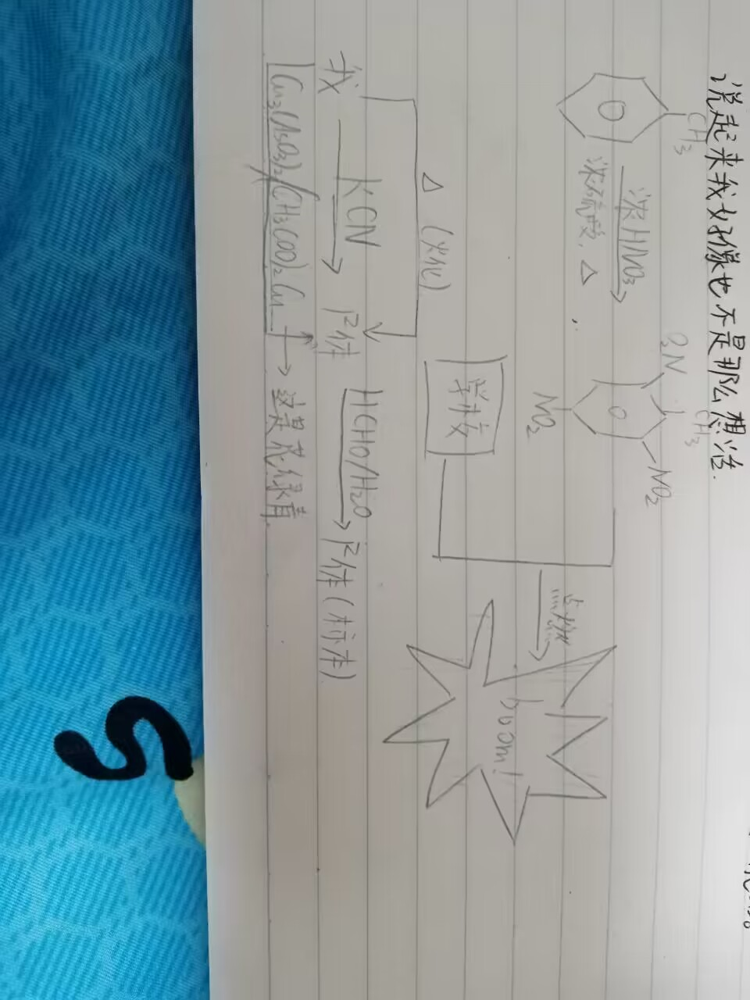

# 重生之我是普通中国人

## 前言

本故事 **纯属虚构**，以第一人称视角叙述。如果你的人生和我的很像，那你活的还挺有趣的。

我是一个转生者，转生到了这个世界。之前的记忆不太清楚了，因此不提。值得一提的，大约就是小学时的奥数与后来的信息竞赛。

小学时，我就是那种比较聪明而且提前学的同学，一直瞧不起课内学的东西，感觉太简单了，不讲都会的那种。但我的才能开始显现，是三年级开始，我去参加奥数比赛，当时我的水平已经远超周围同学但还是没有拿到奖。然后我就去上了学而思学数学。后来还顺便把新东方也上了。然后我就跳跃式的进入了学而思顶尖的班（在新东方学的是英语，学而思也学），在那里遇到了一堆牛逼人。后来也多半跟我进了伟长和苏高。那会大约是我这辈子最风光的时候之一。数学英语水平之高，甚至我四年级去参加伟长的模拟，分数都够上伟长，也拿了一堆奖。

后来五年级的时候接触了信息竞赛。由于我是伟长五升初，因此那是我上初中前一年。准确的说是2018.02.04。我先学了C++的语法，然后开始学习算法，进而学习信息竞赛。我的初中就读于江苏省苏州中学伟长实验部。上了初中也是一直搞信息竞赛，文化课不认真学 —— 奠定了后面几年的文化课基础不扎实。初二的时候普及组拿了个满分就觉得自己牛逼上天了。初三的时候还因此觉得 “我这么牛逼提高组也要考的高一点” 而紧张的要死，把胃搞坏了 —— 后来我胃一直不好。

初三的时候为了中考暂时放下了几个月的竞赛，后来是中考成绩结合竞赛成绩操作一下进了江苏省苏州中学。进了基地班。高一进来也是一直停课，文化课几乎没学 —— 后来补的我想死。然而这样大投入的搞信息竞赛，我连省队也没进，最后就是拿了一堆noip提高组一等然后退役。具体的说，是2022.10.27。到此，竞赛结束，陪我度过了五年的人生。即使是我80岁那天，五年也是我人生的 1/16，也是不小的数字。再见了，所有的oi！感谢你陪我度过了我最傻逼的五年，哈哈，cnm。

退役后，大约摸索了一会文化课怎样学。以前我竞赛的时候偶尔也学两下（网课期间），因此有个大概印象不至于啥也不会。2月左右有个会考，为此稍微停下了学文化课的脚步，专门搞了两个星期。后来也顺利过了。此处，日记开始。

一些别的事情：

- 大约初二的时候认识了同校的hjz和lzj。hjz后来拿了银牌，而lzj和我同期退役并且没有牌。

- 大约初三的时候在机构里认识了tgt。（好像以前就知道名字了？）

- 初三备战中考的时候，开始试着骑车出去玩。

  中考结束后，干了人生里最能吹牛的几个事情之一：骑车30km去常熟

  高一的时候经常骑车去盛泽荡、阳澄湖一带玩。市区里也被我转了个遍。

- 初三备战中考的时候喜欢上了 yorushika。后来加了一些粉丝群。

- 高一的时候偶尔去号爸（南京）训练。初步熟悉了南京的环境与生活以及如何自己出去生活。去号爸，竞赛水平没上去多少，生活能力上去的多。

- 高一的时候认识了福建的 zzl 同学，也和我同期退役并且没有牌。和他定下了一起上浙大的约定，后来成为了我学习动力之一。我喜欢叫他FJ老哥或者zzl老哥。

## 第一篇 高二下

首页插图：我临摹的一个嘉然捧心心。

### Week4. 2023.02.20~2023.02.26

Week是按开学算的。

- 2023.02.24 Fri.

依据陈蓬说法，使用了黑笔，练“果敢”。细想来，确实是这回事，我确实不够“果敢”。

明天就是会考了。这一次过去后，短期让人头疼的政治历史就不用再学了。但最近天天看政治，感觉看生物、物理、英语反而陌生了。有一种刚从OI回来的感觉。估计过几天又要难受一会。

这次解决掉以后，就可以专注地学文化课了。以前还有各种各样的计划，在todo那个本上，近两周都因为会考没能实现。这次也引起我另一个想法，就是把物理/生物的必修部分巩固一下，做必刷题。当然英语的阅读训练和积累也不落下。也要保持数学和化学的进阶训练...关于这些的想法在我脑子里还挺多的。总之先把会考过去再慢慢想。

关于明天的会考，说紧张也紧张，毕竟今天的”自主复习“我是一点也没，哦不，看了一点。但那是真的一点。不过从前几日做模拟卷的表现看，大概没问题。生物可能略危险，但就算考不过，高三也不用花额外的时间准备，因为本身就要复习。基于这点考虑，似乎真不用担心什么。

另一个挺大的事情是，今天是退网，不如说是戒网，day5。我居然真的戒了，用网只进行了（目前）打电话，看班级群通知，看生物网课，看街角魔族漫画（我认为人活着不能没有街角魔族！）。在不能水互联网并且想娱乐时，还是很难受的。虽然强忍着戒了网，但我干什么又成为问题。看书也看不下去，心里像被火烧一样，非常急，啥也不能耐下心做。最后只好走来走去，然后干脆打坐，像在修仙一样。后来想起来干脆写日记好了。果然文字能让人平静下来。

戒网日期是到3.21春分那天。也就是我戒网差不多了以后，春天也不知不觉间来临。什么时候才能到春天呢？今天也等待着春天的来临。

- 2023.02.25 Sat.

会考day1结束。政治有一种过不去的美。地理还好，应该行。物理生物巨简单，睡了好久。

今天上网看了一会历史，然后去看海贼王了。这下破戒了。不过总的来说还算收敛。严重警告，下不为例。  也看了本子，但这个不算，这是享受生活！ 我还真挺好奇的这样坚持一个月会怎样。

准确的说，写这些时已经是02.26的00:20左右。比昨天睡的略早，但也不能不睡了。感觉写的有点少...就这样罢。

今天是戒网day6。距离春分日还有24天。春天啥时候来啊，要被冻④了，蛋白质给我冻变性了。

### Week5. 2023.02.27~2023.03.05

### Week6. 2023.03.06~2023.03.12

- 2023.03.08 Wed.

居然这么久没写了。会考完的一周是忙碌的一周，压力骤增。以往那种可以用来休息或者补内容的 “空隙” （比如历史政治课）少了许多，因此上周没有写。上周末一结束就去了淮安，自然没得写。这一周又是监狱生活的重复。上次会考去三中的时候就发现，人活着的意义就在于那些让你感到轻轻松松的，很舒服很享受的事情，让你感觉“不想死”的事情。这时我才感觉到“活着太好了，我不想死”，而不是每天都他妈卷的想死。若是这样活着，我认为，真不如死了。这两周就给我这种想死的感觉。不过我还缺一次会考后的放松。冲！

这几天有不少挺exciting的事情。前不久，物理必刷题选必一补完，生物选必二连学带练透补完。算是完成了上一个阶段目标 “补生物和物理”。现在只差近期的一小部分内容了，快的。因此最近也要考虑一下，下一个阶段目标是什么。粗一想，要将矛头对准语数英。到现在我的todo本上也没有一点内容，挺难受的。感觉失去了目标。

<!-- 今天是首个在宿舍里打∠的日子。真是太有趣了！世界真奇妙！仿佛看到了宇宙循环！ -->

今天是戒网挑战day17。依然没想出不用网干什么，只有写这吊日记。

最近气温大幅上升。尽管还会有两下倒春寒，不过春的脚步已经无法阻挡了。距离上次仅十余天就能有如此变化。春よ、来い！

### Week7. 2023.03.13~2023.03.19

- 2023.03.19 Sun.

距离戒网目标还有两天。最后冲刺！不过这中途并非那样完美，上了两次Q，都是讨论数学。还看了一次海贼解说。白警告了。总的来说，完成度还算高。结论是，退网以后，心情好一点，但好的不多。

按理说后天就应是春分日了，春天应该过半并直奔夏天了。不知怎么回事，最近温度低的④马，找回了冬天的感觉。好好的3月硬是过成11月。就不能再让我体验一把春暖花开的感觉吗？有一说一，花是开了，暖是真没有。

补完生物物理，本以为是一大步，才发现只是第一步。而且也没有那么大。接下来才是真正的文化课：步步紧逼的六门功课，无尽的作业与学习任务使人难以呼吸；日日减少的剩余时间，即将到来的考试压迫感十足。不仅要拼命，还要长期的拼命。现在的我，不做出这样的觉悟，怕是难以在如此短的时间内，干掉一大半同学然后考上浙大。敢夸下海口的说出目标，就要敢拼命去卷。我做好觉悟了吗？

### Week8. 2023.03.20~2023.03.26

- 2023.03.22 Wed.

退网结束了，感觉很有成就感。不过最近（今天）的上网体验给我一种再退一个月的冲动。

好久没上网了，跟tgt聊了两下，好吉尔爽啊。不过有一种聊不起来的感觉，明明很喜欢的，却想不到说什么。跟某人也有类似感觉。我看起来似乎不擅长说话。学竞赛学的，傻逼。

毕竟是日（？）记，把情况记录一下。近两天文化课有一种无力感，到处碰壁，发展不起来。不仅如此，由于要兼顾所有学科而不是像以前一样专门搞几科，现在时间相当紧张了。空余时间最多一个晚自习加上回去一会，要搞全科。而且还有之前遗留的问题，如毅力不足（有所改善但有所欠缺），容易受心情影响，等。有时回忆起以前的日子，还会emo两下。今天和tgt聊完就有这种感觉。具体的，问题主要有：

1. 英语：练了很多完型阅读，还要错很多；看了很多语法学案，做语法填空还错一堆

2. 数学：总的来说就是导数和圆锥曲线都比别人菜一点

3. 语文：目前只会背诗，别的不会。

4. 动力：我动力来自 ① 因为OI挂了所以文化课不想再挂 ② 与zzl老哥约定，后来演化成了“他咋这么牛逼我好急”；总的来说，太“痛”了。它并非根源于快乐而是痛苦。根源于快乐的学习，我这辈子只见过一次，有且仅有...

5. 经常emo：可以理解，但影响有点大了，而且经常发生：不经意想起往事，数学课讲到OI...

6. 遇到困难易放弃：以前就是，做不出来一会就去看题解了，感觉省队进不去后期就摆了...现在也是，感觉遇到困难，四处碰壁，就不想学了。缺乏"virtue of determination"

   我觉得我应该：

   > Always give your best in whatever you set out to do, however difficult it might be. （英语书）

没了，晚安

### Week9. 2023.03.27~2023.04.02

- 2023.03.28 Tue

感觉这一周比上一周过的慢。上一周有一种卷疯了的感觉，一整天都tm在卷，不知不觉一周过去了。这两天动力不是很足啊感觉。怎么回事呢？不过人就是这样的，并非机器，会受状态影响。

这次准备开个半退网。保持少量页面可以访问，其余禁止。后证明并无卵用，还是上网吧。

> 后期评价：要么不做，要么一做到底。半吊子的决心只会一事无成。

### Week10. 2023.04.03~2023.04.09

- 2023.04.07 Fri.

前几天说退网不知道干什么。回想起来，后期冷静下来后，阅读就是个不错的选择。下次如果退网，多读书，提高文化素养。

新想法。养成这样一个思考习惯：并非“希望...就好了”，而是“如果...没发生/失败了，怎么办？” 前几天就这样想了，最近实践起来发现非常有用。当然不要走极端的总是这样想，蛮消极的。

晚了，明天说。

### Week11. 2023.04.10~2023.04.16

- 2023.04.12 Wed.

听cjq说今年省选十分sb，还临期扣了四个名额，hjz和lyx都没进。原本对OI还有留恋，这下给我干沉默了。也因此hjz回来了。我超！

期中考试，4.06~4.08，结束了，成绩也出了。期初考试（2月左右，没记）排名是350多，这一次到了247，进步100多名。“这还远远不够”，尽管我尝试这样说服自己，还是不禁骄傲自满。人性是这样的没办法。但也要认识到，要进浙大，确实远远不够。

这次一大特点是每科都不高。语文84数学108英语121物理83化学70生物61（生化原始分）。这不绝望，让我们知道每科都有可观的提升空间，不是 “每科都高到没法提了分数还是不够”。以后也许要面对这个问题，幸运的是现在不用。

目前方向大致如下：

语文：①找lwt学文言（和hjz一起）②熟背课内古诗文，还要把握字词与翻译 ③看B站网课

英语：①背以前书此表 ②整理词句（from 报/书/题目...）③读作文一本通 ④ 做语法学案

物理：①整理错题 ②补学必修三 ③做必刷题上留下的空隙

化学：①整理错题 ②做红大本 ③学有机

生物：①补必修三 ②做总复习题 ③看课外书

数学搁置。

上篇中没说完的，有一个“大todo”的想法。意思是，每天一个专题，专攻。做完作业与基础练习后做。顺序为 “语英X物化生”。“X” 为自由学习，想学啥就学啥。这是一个新的idea，以适应接下来每科都要学的现状。但可能有如下问题：

1. 太散，每科时间不足

2. 精力分散，每科效果都不好

   ~~就像当年OI和文化课一个也不好...~~

3. 每天作业多，自由时间与精力不多

将在实践中检验它是否可行。

最近准备学有机。周末准备通个宵，感觉会很有趣。

4.12那天去了周庄，十分甚至九分舒服，我觉得我就是他妈喜欢出去玩。

和zzl老哥立了新的flag，期末考到前200就去福建找他玩，不然我暑假整个都不出去玩。

最近要想想自己的内在学习动力，不能总是依靠别人作为动力。

- 2023.04.16 Sun

 Warning: 通宵 

### Week12. 2023.04.17~2023.04.23

- 2023.04.18 Tue.

客观评价一下这次通宵。效率不高，没有理想中高，可以说是历史上最低效的一次通宵。不仅12:00才开始，而且2:00~4:00还睡了一觉，也没有睡好。7:00临“起床”时还睡了一小觉。

但这次确实有一定效果。“万事开头难”，本来我学有机一点头绪也没有，现在至少开了个头，而且框架也大致建好了。有了“骨”，接下来就把“肉”填进去即可。这当然是不小的工作量，但就像骑车回家：方向是明确的，路途再远，只要坚持向前，必然能够到达。不足之处在于这次通宵填进去的“肉”有点少。

今天把前阵子想干的事情干了。和lwt定下了约定，期末不到前200，我的mp3就送给lwt。感觉这个非常exciting啊，让人不禁觉得“青春就应该是这样才对”。这下有了双重约束，要加把劲才行。

今天在生物书上看到了可爱的鼠鼠，把它临摹了。原日记上有图，这里略。

最近想到了新的id：LiZ。就是由LightningUZ简写来的。原来那个又长又中二，实在是...小学时候想的后来就不忍直视了...

- 2023.04.19 Wed.

今天准备开个impart。因为在周三开impart可以把想死的一周分成两半，好受一点。但在这监狱学校里什么吊事情也做不了，只能写日记抒发一下怨念。

家人们谁懂，咱就是说，一整个无语住了。宿舍里有sb现充。zhs啥时候死啊。

原日记里还有诅咒小人诅咒他。这里省略。好恐怖哦。

注：这人名叫赵鸿硕，大概3.20前后谈的女朋友，那会没有记下来。

今天久违的回了一趟机房，是家长会的时候跑过去仔细了。不过没怎么碰电脑，因为它已经不再是属于我的东西了。hjz好像还有书放在机房，迟迟没有拿走。是懒得搬吗？还是对OI有所留恋？

- 2023.04.23 Sun.

今天是学生时代第一次装病。有了一天额外的假期时间。蛋疼的是，我既没玩的开心，也没有卷的高效，因为我一直摇摆不定。摸鱼的时候紧张焦虑，卷的时候浮躁不定。虽然是首次装病居家，却没留下太好的回忆。既没有玩的尽兴的回忆，也没有卷的爽快的回忆。

为了避免类似的事情发生，以后假期要仔细规划。

### Week13. 2023.04.24~2023.04.30

- 2023.04.30 Sun.

今天是五一的day2。昨天和今天把之前的日记抄完，能写新的了（原来的本子坏了）

前几天一直想着的五一终于来了。放了五一，整个人都变好了。昨天天气不太好，出去玩没去成，今天下午去阳澄湖边小玩了一把。“从学校里放出来后，阴霾的天空也显得漂亮了许多”。这是我当时发的动态。

回头看日记好有感觉啊，重新领会到了当时的迷茫和在迷雾之中勇敢向前的觉悟。

正好说一下以前提过的问题把。

1. “大todo”

   时间太缺了，真的学的没啥效果，和想的一样。

2. 在03.22中提到的一些个人问题

   关于动力问题，暂时没有改进，但好像不怎么影响。

   对于OI的念想，在04.12那次跟cjq聊天后就完全好了。

   遇到困难易放弃...文化课遇到的“困难”都不是很大的困难，因此没有体现出这个。

3. 文化课

   原本数学搁置了，因为没什么头绪。最近发了几本一轮复习的练习题，做起来感觉好爽啊，想便秘多年后通常的拉屎一样通常。事实证明，所谓的“没头绪”，就是缺本题做。

   英语去找xf私聊了一波，也通畅了许多。大致上有这些事情可以做：1. 买卷子做，做上海/广东/湖南。2. 可可英语 BBC 6min-English 3. 刷阅读是有用的，继续，并尝试写一些小语段概括文意 4. 背单词，很关键 5. 语法学案，时态，句型...各种都做一遍 6. 读作文一本通，练审题：自己想一遍怎么写然后看看范文怎么写。最后还要多琢磨，琢磨错题，琢磨阅读，琢磨别人的文章是怎么写的。

   语文方面，文言文已经在补了，想办法把文章阅读理解也提上去。

因此我们遇到困难不要急。你看，这不是正在逐渐被解决么？

### Week14. 2023.05.01~2023.05.07

- 2023.05.01 Mon.

我去，五一咋没了？

上一篇，4.30那个，是上午写的。当天下午觉得大好春光不去玩可惜，去同里勇闯水乡了。然而那个吊地方可以说是荒无人烟，除了景区玩全都是乡下。看地图上有很多湖，但都没有路通过去，而且那个路走起来比看起来远多了，最后一个也没有看到。路上也没有小店，没地方买水，差点渴死在路上。幸好被路过的农家所救，在那里喝了两杯开水，和老头老太闲聊了片刻，颇有趣味。然后走到同里去，终于有物资了，还看到了同里湖。在那里水了一会群。然后就回去了。

回来以后就要卷了。开始卷生物，想着先把生物干完，然后去学一点有机，再看一会物理和语文...而实际结果是光一个生物就把我卡主了。先看一会孟德尔，再来一点减数分裂。一上来就是高中生物数一数二的难点。去做题，发现有丝分裂学的一坨屎，又把有丝重新学一遍。这样不知不觉一天就无了。哦，还看了一点细胞器，重新做了笔记。

这样看来我五一效率实在堪忧。也可能是做这些本来就意味着这么多工作量，但我也有不足之处。如果把下雨的day1高效利用起来而不是摆烂一整天，想必可以多做点事。至少有机可以开出来了。

啊，突然想起英语没搞，xf我对不起你qaq

把当下的问题记一下。上次说了“解决了哪些”，这次关注“还有哪些“

1. 化学：目前水平还可以，但还可以再上一层。有什么好办法吗？目前缺少头绪。是否需要再买一本题来做？
2. 时间：对于生物、数学、英语，要做什么比较明确（物理还没开始一轮，要等；语文在摸索），但单纯缺少空余时间去干我脑子里想干的事。
3. 急：我现在心态很急，事实上现在的情况可能还蛮乐观的但我一直紧张焦虑。

> 后期评价：真的乐观吗？

### Week15. 2023.05.08~2023.05.14

- 2023.05.10 Wed.

时间过的太快了，刚回文化课的场景仿佛还是脑中的上一幕。当时的我如何会想到，仅仅五个月，我的文化课水平就到了如此程度呢？

在5.6那天，周六回家。本来想去金鸡湖边欣赏夜景，却遇下雨，没能去玩。但我偶然想到可以回syc玩一会，经打听，syc现在在和基广场3楼，便回到临顿路过去。和周老师交流很有趣，给我新的角度学习文化课。我的问题在于，我缺乏学习的自主性，并且缺乏学习的计划，而且不讲方法。

首先，学习应该是自发性的，对世界感到好奇，对知识充满渴望...观察下来，我对知识保有较强的好奇心与求知欲，并且十分向往那种知识全部融会贯通的贤者的感觉。那我怎么会没有自主性呢？原来是遇到的阻力太大了。本质上是因为我缺乏意志力，遇到一点小困难就会产生很大的精神阻力。这和我的成长环境等因素有关。我现在每天早起跑五圈再吃饭然后去教室，以此练意志力。后面可能加圈。

然后是学习计划。这个好解决，安排即可。不过这次更有组织性，有一个阶段目标并且分解为周任务，然后精确到每一块时间：午休干什么，晚自习干什么。并且加入了调节机制，时间多了干啥，时间少了怎么办。这成为新一代版本，和之前简单粗暴的todo不同，被我记作 $\alpha-todo$。

最后是方法论。我对这方面了解甚少。理论上可以和老师交流，但我并不擅长和老师交流，也不擅长提出有价值的问题。前几天刚写过这个作文，但我恰恰就是那个不会提问的。我也不知道怎么样能让我学习到这方面的内容，实在没有头绪。

- 2023.05.14 Sun.

这周顺利完成了 $\alpha$ 的任务。果然这个合理，是可执行的。

今天有个sb孔子讲座，没去，狗都不去。发生了有趣的事件，记录一下。

先是班长黄昱豪在讲座上看手机，被李丹老师发现，没收。然后他又和同学讲话，又被发现，李丹老师很生气。结束后，11班同学就被留下来训了30分钟。他还扬言“你们有985分数却没有985的品行，考上清北也不要你们这样的学生”，还要把黄昱豪踢出我们班，甚至要把11班解散分到各匡班去。说到这，同学们都觉得很乐，”啊那你做做试试啊“，抱着这样的心态，大家开始了鼓掌！像是看小丑一般，洋溢着欢快的笑声。这下李丹彻底急了，11班陷入危机！我并不在场，是听同学描述的。具体如何，明天再说。

闲话到此，记下近况。今天回顾了一下，回文化课至今五个月，都做了什么？

早期~本学期Week6左右（3月多）：集中力量补近期的物化生，效果不错

Week6~Week13左右（4月末）：陷入迷茫，保持物化生学习，但语数英没有头绪，一直碰壁

Week13至今（近期）：没有完全走出迷雾，但已有光点可见

现在面临的“迷雾”主要是：学习语数，不见成效。英语的练习，不清楚强度如何，占多少时间，效果怎么样...我喜欢描述为“没有找到感觉”

最近要做很多“探索工作”。试试这个，试试那个。哪里好？哪里有问题？不断完善学习的方法。

昨天，5.13，初次体验了chatGPT。总的来说相当精彩，但在细节的问题上，偶尔出错，而且不会配平化学方程式，而且容易被我带偏...仍有缺点。正确观点是 “择其善者利用之”。

### Week16. 2023.05.15~2023.05.21

- 2023.05.15 Mon.

时间后续来了，大致就是 lwt 和 wxl 各说一顿。lwt比较开明，把们关起来封闭自由讨论。出现了一些过激的声音（点名zhc）。wxl不太留情，上来就一顿输出，”如狂风骤雨般批评“（本人语）。部分班干部和黄昱豪被叫出去谈了。

算了，到此为止，蛮傻逼的。

今天好困，总之就是好困，严重影响学习，正在想怎么办。

- 2023.05.21 Sun.

我去，时间咋过的这么快，不知不觉又一个月过去了。夏天的气息稳定了下来，前一阵还有很神经病的降温，现在基本一直很热了。

上周主攻生物物理，本周主攻英语。明显感觉难受许多，甚至没时间没精力写日记。本周采用了较为平衡的安排，有文有理，效果位置。我也许需要一些每天都干的基础任务，而且还得比较多。要重视语文英语的积累作用。

感觉语文的摘评可能会很有用，最近试试。不要图快，要倾注思考。

前几天报名了南京大学计算机学科营，今天收到消息初审通过了。好耶！FJ老哥zzl也通过了，可以面积了。好！！！1！5！哥们在这给你说唱！

这周语文作业要收集一恶搞像诗一样的歌词。选了ヨルシカ的希区柯克那一首。很动人，也很有诗的感觉。以后的人生怎样才能过的快乐呢？只想望着蓝天是一种任性吗？...

今天去小旅行了一把，观前街+平江路，喜提新笔一根，在猫空买的。写着 “猫的天空之城 x RiCO” 。但 RiCO 是啥啊...

距离期末只有一个月了。感觉好紧张。时间过的好快，好有危机感...希望这能化为我的动力而不是压力。考场上别发挥失常了...

### Week17 2023.05.22~2023.05.28

### Week18. 2023.05.29~2023.06.04

### Week19. 2023.06.05~2023.06.11

- 2023.06.05 Mon.

我去，鸽了两周！

今天最重要的是，刚从南京回来，记一下南京的事情。南京之行的主要目的，并非是在考试里拿个什么成绩，而是和zzl老哥面基。2号（周五）去的时候，玩了一整个下午。相当爽。当天的形成大概是先吃一顿萨莉亚，去仙林湖公园，然后去总统府（北伐！），去夫子庙。在仙林湖公园里我是第一次下野湖玩（仅限近岸处，有可见较浅湖底），很有趣。他好像并不喜欢很亲密的肢体接触，也没让我跑去他房间里玩。可能福建人比较保守。

在南京还认识了一个四川女装老哥，和两个内蒙古老哥。矫正了我的一些刻板印象，比如“骑马上学”之类的。后面我还自己跑出去玩，去了一个不知名的小破公园，和羊山湖公园。很静谧的感觉。只是略显孤独...抛开那种事情不谈还是很有趣的。

回来的路并不顺利。因为个人原因（当时一直在看幸运星），出发时，时间比较紧张，得尽快坐地铁去火车站。然而那个破地方离地铁站很远，而且还下了小雨。走路过去非常远，自行车也得骑一会，我还有行李箱。没办法，我只好雨中单手骑车，另一只手拿着行李箱。平衡很不稳定，得亏路上没车不然指定被创死。三天来，“腰酸背痛头晕眼花”的状态几乎一直伴随着我，甚至今天还没好。真要命了。

今天回来上文化课，由于昨天没睡好，学校里睡了4h。真要命。啥也没听进去。

妈的。每当我上学想死的时候就感觉时间过的好慢，有啥事情要干的时候又感觉时间过的好快。

把最近想的idea记录一下。

1. $\alpha$。对于语文英语，可以把原来的“大任务“拆成小任务，然后每天都做一点。毕竟这俩是考积累的，一天做很多没用，每天做一点更适宜。
2. 学习记录。手动的ManicTime。记录学习情况和任务完成情况。然而还没有养成习惯。

## 第二篇 高三

重磅来袭！

从暑假就开始算。

### 暑假

- 2023.07.06 Thu.

  对于暑假的许多想法，尚未有效实行。已经过去的6天中，虽然很充实，但总觉得哪里还不够。

  想法：

  1. 狠狠补数学。 立体几何，数列，导数，三角...
  2. 狠狠补物理。实验，必修三电学，必修二天体...
  3. 狠狠补语文。看看b站网课。

  效率不足？

  1. 早上利用率低。未明确记录，但能感觉出来。
  2. 白天容易睡觉
  3. （如果去图书馆）晚上回家完全没效率，都去玩电脑了

  很明显，本来满当当一天，却几乎无效，只有一个下午有效，有何P用？

  想法是把 α-todo 推进落实，每天安排好干什么，并记录下是否完成，花哪些时间完成。

  可将练字等任务安排到低效的晚上，早起可以运动之类。

- 2023.07.13 Thu.

  上次的问题仍然没有解决。话说咋一周已经没了？

   Warning: 通宵 

  今天我算是发现了，我还是竞赛时那个屌样，一点没变。一张英语卷子摆在面前，40min多点就能做完的，硬从下午两点拖到晚饭，再从晚饭拖到晚上九点（现在），一笔也没动。你的时间都去哪了？

  我想了想，这不是和我以前摸一天鱼，题一点没想，一个屌样吗？啊？你说是不是，完全一个屌样！我喜欢把这个比作"活化能"，但是精神能量。学习的“活化能”大，而颓废的“活化能”小，于是都颓废去，就是不学习。久而久之，学习的“活化能”越来越高，难以越过，以至于我现在把手机电脑封印了以后，依然他妈不学习！！！

  我想了想，又想到一件事。以前学竞赛，刚开始学，动力满满，一副勃勃生机、万物竟发的境界犹在眼前。后来，不如当年一般精神了，可谓乌烟瘴气，萎靡不振，硬撑着送走一个高二。妈的得亏退役了。刚回文化课，如之前所述，也是很积极向上的。现在呢？！我他妈，仿佛看见了当年竞赛的我！！！难道说，我就是这种三分钟热度的人吗？如果是，我想，我这辈子，基本完了。要想做成一件大事，需要长期坚持的努力。前半段，可以用青春热血，兴趣，甚至一时兴起来度过（竞赛就是），但他们都无法长期延续。后半段，将会是一段痛苦之旅，地狱之路。它也许不会通往地狱，但必须要在地狱里走一段。

  妈的，就这还想上你那浙大？

### 期初考&week1

- 2023.08.09 期初考day1

  暑假里真是没怎么写日记，或许是因为暑假里面，或者学习或者摸鱼，都比较忙，无闲暇写日记。

  前几天，暑假的最后两周，来学校自习，有效解决了我在家效率低、去图书馆麻烦的问题，也可以登记出入校门解决出门问题。在此帮助下，我高效完成了语文英语化学作业，并着手做一些自己想干的事情。把暑假计划中一直咕咕咕的部分一口气推进了。好！...但实际上还有不少活没干。后悔没早点觉悟。

  暑假期间还有个插曲，我乱搞icalingua，qq惨遭封号。重开，开俩，一个工作一个摸鱼，然而那个工作的号又被封了。妈的。当时都加了班级群了。没办法，只好用那个摸鱼号去加班级群了，分号计划惨遭失败。捣鼓老半天，前几天才搞好。

  暑假里认识了一个有趣的网友。可能七月以前就加了qq，但不怎么说话。有一次，大概在七月初，天将大雨，黑云压境。暴风迎面压来，几乎能把手机吹掉。

  （纸质日记上这里写了个 “待续...”，因为当时太晚了，要考试，不能熬夜，就中断了）

- Week1. 2023.08.16 Wed.

  今天有空写日记了，是机会特殊，写作业写到了23:55，室友都睡觉了。不过该日记要被线上同步，或许得等一会。

  我靠，上次日记还有个“待续”，高三是这样的，很忙。下面接着说。

  妈的，那天的风真的很大，很爽的感觉。然后我就把这个大风大雨分享给了同城的好朋友们。然后她好像是特别高兴，就像对上了电波一样。我也是十分高兴啊，毕竟很少有人能自习品味自然的美。后来也经常聊天，得知她是新实的同学。喜欢yrsk。没有写中文是因为我提笔忘字了。好jb尴尬。展示一下，这个就是高三同学的文化水平。妈的，我就觉得，喜欢yrsk的没有坏人。事实证明确实是这样的。

  说点近的。高三正式开学了。我就觉着，nmd，作业咋这么多。明明白天写了一点，甚至还把后面的作业提前写...咋不见少啊还jb越来越多。我可去您祖母的。傻逼学校！傻逼！监狱！操你妈！！

  > 再见了，人类！我要把你们全都炸飞！
  >
  > —— ヨルシカ 爆弹魔
  
  （注：纸质日记上的字体，此时已经飞起来了，看起来充满了怨念，很吓人）
  
  说起来我好像也不是那么想活。
  
  附纸质日记上的发疯图
  
  
