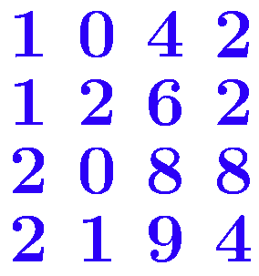

前言: 什么顺序讲?

其实最需要想一下的是怎么写行列式。

南大课本（指一层次线性代数的那本蓝色的书）上是行列式起手的讲法。这是臭名昭著的，我肯定不这样讲。《Linear Algebra Done Right》中是先从向量空间引入的，但这样就导致行列式的定义在很后面。

说实话，其实我也不是很清楚行列式到底是怎么被搞出来的，我只知道怎么算并且怎么用，但还没有理解到本质。因此这篇文章会比较唐突的引出行列式。我也不想这样但我水平真的有限。

总的来说，我会参考LADR，从向量开始介绍。

另外，本篇面向的是那些，“觉得线性代数有点枯燥但还是要学” 的大学生，或许能使你激发对知识的探索欲。

本篇的行文风格是，对于一个新内容，尽量启发性的去发现这件事，然后再写出形式化的描述并证明

<!-- more -->

## 向量

和我们高中学的是兼容的。 例如 $\overrightarrow{a}=(x,y,z)$ 表示一个三维向量。

对于一个更高维的，比如 $n$ 维向量，就写 $n$ 个分量就行。例如 $v=(v_1,v_2\cdots v_n)$。

所有的 $n$ 维实向量构成的集合记为 $\R^n$。

> 补充：关于复数
> 
> 由于我们并不强调复数，因此我们默认是在实数域里讨论。后面说到 “标量”，通常默认是指实数。

为了节省我的阳寿，后面就不打箭头了，直接用 $a$ 表示向量。懂的都懂。

作为第一部分，我们先来把向量给折腾一圈，即使我们还没引入任何矩阵相关的概念。事实上，确实，即使不需要矩阵（或者说，线性变换），我们也可以对向量做很多事情。

### 线性运算

向量可以进行 **线性运算**：数乘、加法

数乘: $v=(v_1,v_2,\cdots v_n)$，则 $kv=(kv_1,kv_2,\cdots kv_n)$，$k$ 是标量

加法: $a=(a_1,a_2\cdots a_n),b=(b_1,b_2\cdots b_n)$，则 $a+b=(a_1+b_1,a_2+b_2,\cdots a_n+b_n)$

只要我们能进行 **线性运算**，就能做 **线性组合**：

对于 $n$ 个向量 $v_1,v_2...v_n$，其线性组合为 $v=k_1v_1+k_2v_2\cdots +k_nv_n$，其中 $k_i$ 为系数。

> 能做线性组合的 “对象” 并不只有向量。
>
> 例如，一堆多项式，可以做线性组合（多项式有数乘和加法）。甚至于一堆函数，定义“和”为对应位置的和，则函数也可以做线性组合。
>
> 因此 LADR 这本书上其实并不区分这些，多项式之类的东西也可以构成一个“向量空间”。
>
> 更为牛逼的是，对于函数这样的“向量”，我们甚至也可以用积分定义它的“内积”！甚至可以用这个结合柯西不等式证明一些和积分相关的不等式。我当时读到这里的时候，不禁惊叹于线性代数的美妙！

我们发现，线性组合是一个很灵活的事情。联想高中学过的 “平面向量基本定理”，如果我们有两个不共线的平面向量，我们可以用它们来线性组合出平面上的任何一个向量。是不是很牛逼！

再来看一个东西

**线性相关与线性无关**：对于 $n$ 个向量 $v_1,v_2\cdots v_n$，如果存在 **非全零** 的系数 $k_1,k_2\cdots k_n$ 使得其线性组合 $v=0$，则这 $n$ 个向量 **线性相关**，否则我们称它们线性无关。

也就是说，线性无关的意思是：若要用 $v_i$ 线性组合出 $0$，必须系数全都是 $0$

这东西有啥用呢？

首先感受一下这个，我们解方程的时候，经常碰到一些 “无用方程”，比如

$$
\begin{cases}
x+y=1 & (1)\\
y+z=2 & (2)\\
x+2y+z=3 & (3)\\
\end{cases}
$$
你发现方程 $(3)$ 显然是一个“无用方程”，因为它等于 $(1)+(2)$。

事实上，我们把这些系数写成向量，“无用方程”就是在说，这个方程可以被别的方程线性组合出来，也就是说这几个方程线性相关。如果要找出“极大的有用方程”，只需要找“极大线性无关组”就可以了！

那么，我们小学时候就学过的多元一次方程组，现在我们对它有了新的见解。事实上，线性代数中关于线性方程组的内容非常多，后面还会获得更多的新的见解。

再透露一件事：对于 $n$ 维空间，只要我们找 $n$ 个线性无关的向量，它们就一定能组合出整个空间！

于是 “平面向量基本定理” 被推广到了 “$n$维向量基本定理”。是不是充满了牛逼道理！

想必，就算你是第一次接触线性代数，也一定对线性相关性的概念充满了好奇。

那接下来，我们就进一步关注：我们的这些向量，能组合出一些什么东西？我们还能用它玩出多少花样？

### 向量空间

#### 概念

接下来，引入 **向量空间** 的概念：向量空间是一个向量组成的集合 $V$，满足：
1. 存在线性运算：$V$ 中要定义线性运算: 加法、数乘，且 $V$ 对该运算封闭
2. 满足运算律：“大八条”，在各种课本上都能见到

存在线性运算且封闭，定义为：
- **加法**：$\forall a,b\in V$，有 $a+b\in V$
- **数乘**：$\forall a\in V,k\in R$，有 $k\cdot a\in V$

“大八条”，为：

1. 零元素：存在零元素 $0$ 使得 $\forall a,0+a=a+0=a$
2. 负元素：对任意 $a$，存在 $-a$，使得 $a+(-a)=0$
3. 单位标量：存在标量 $1$，使得 $\forall a,1\cdot a=a$
4. 交换律：对任意 $a,b$ 满足 $a+b=b+a$
5. 结合律（两条）：
$\begin{cases}\forall a,b,c\in V: & (a+b)+c=a+(b+c)\\\forall k,l\in R,a\in V:\quad & k\cdot(l\cdot a)=(kl)\cdot a\end{cases}$
6. 分配律（两条）：
$\begin{cases}\forall k\in R,a,b\in V:\quad & k(a+b)=ka+kb\\\forall k,l\in R,a\in V:\quad & (k+l)a=ka+la\\\end{cases}$

对于给定的 $V$ 和定义好的加法、数乘运算，“大八条”是只针对运算本身而言的，而“封闭”的限制主要针对 $V$。当然，“大八条”也和 $V$ 有关，有时候，某个运算在 $V$ 上没有交换律，但是在 $V$ 的子集上就满足交换律了，也是可能的。

向量空间的“空间”并不是凭空来的。例如，平面上的一条过原点的直线，直线上的点表示的向量就组成一个向量空间（可以自行验证）。向量空间的确可以表示一块“空间”，可以是直线、平面，也可以是更高维的空间。

由于我们只要定义了运算并且满足了运算律，就可以构成一个向量空间。所以向量空间的形式是很自由的。比如，我们对定义在 $R$ 上的函数定义加法和数乘，那它就可以构成一个向量空间。

向量空间可以是无穷维的，比如上述函数向量空间。不过我们主要关注有限维的向量空间，因为我们很难研究一个无穷维的空间。

刚才我们研究的是 “$n$个向量”，现在，我们可以去研究 **空间**，也就是 **无穷个向量**！

#### 张成空间

现在，假设我们有了一堆向量，它们能 “组合出来” 哪些向量呢？

**张成空间**：记为 $\text{span} \{v_1,v_2\cdots v_n\}$，表示 $\{v|v=\sum k_iv_i\}$，也就是说这个东西表示向量组 $v_i$ “能拼出来的向量集合”。

**张成**：对于空间 $V$，若 $\text{span}\{v_1,v_2\cdots v_n\}=V$，则称向量组 $\{v_i\}$ 张成 $V$。

（前者“张成”是形容词，代表“张成的”；后者是动词）

注意这里 $k_i$ 可以都是 $0$，因此 $\text{span}\{v_i\}$ 中包含 $0$。而且我们可以证明，张成空间是一个向量空间。

> 首先我们无需再验证 “大八条”，因为向量的加法、数乘的运算律我们已经清楚了。
> 
> 其次我们验证封闭：你发现它显然封闭。证毕。

我们可以举例子感受一下。例如 $v_1=(1,1,0),v_2=(0,1,1),S=\text{span}\{v_1,v_2\}$

那么 $(1,10,9)\in S$，$(1,1,4)\not\in S$。 $(3,8,5)\in S$。而且 $(1,10,9)+(3,8,5)=(4,18,14)\in S$。

我们可以观察一下，发现对于 $(x,y,z)\in S$，都有 $y=x+z$。因此张成空间 $S$，实际上就是平面 $x-y+z=0$。

想像一下“张成”的过程：最开始，空间中只有虚无，从一片虚无之中，出现了两个向量，一个是 $v_1=(1,1,0)$，一个是 $v_2=(0,1,1)$，这两个向量搭成了一个 “骨架”，以这两个向量为 “骨”，不断出现了 “血肉”：这些“血肉”都是以“骨”为框架编织而成。由于我们的“框架”有所局限，它并不能编织出整个空间，只能组成一个子空间，也就是平面 $x-y+z$。“张成”这个词，就跟这里的“编织”很像，就是给它俩拼一拼凑一凑，组成一块空间。

> 好中二啊。。。。

我们再来观察一个例子。上述基础上，再加上 $v_3=(1,2,1)$，$S$ 变成了什么？

诶！你发现它不变。因为 $v_3\in \text{span}\{v_1,v_2\}$，所以加上了这个 $v$ 并不能使得它张成出新的东西来，都是旧活，整不出新活。我们换个角度描述，这就是说：$v_1,v_2,v_3$ 线性相关。

结论：对于向量组 $v_1,v_2\cdots v_n$，若 $v\in \text{span}(v_i)$，则加入 $v$ 后，其张成空间不改变，而且，加入完以后，向量组必然线性相关。反之，如果 $v\not\in \text{span}(v_i)$，那么张成空间必然会变大。证明很容易。

#### 折腾空间：和，交，积

对于向量空间来说，我们还能稍微折腾一下它。这个内容在课本上 $^{[\text{注}]}$ 没有，但我们知道这东西，有利于促进认知，有时候做题有用。

> [注] 其实不然。我以为没有，事实上是还没讲到。书上是有的。

子空间：对于向量空间 $V$，如果 $V_1$ 满足 $V_1$ 也对线性运算封闭并且 $V_1\subseteq V$，那么 $V_1$ 是 $V$ 的子空间。 最小的非空子空间是 $\{0\}$，$V$ 本身是 $V$ 的子空间。

子空间的**和**：对于向量空间 $V_1,V_2\subseteq V$，定义“和”：$V_1+V_2=\{v|v=v_1+v_2,v_1\in V_1,v_2\in V_2\}$

- 直观：就是把俩空间里的向量，各取一个，加起来。

- 性质：$V_1+V_2\subseteq V$，和空间仍然是子空间

- 容易发现：**$V_1+V_2$是同时包含 $V_1,V_2$ 的最小子空间**。
  
  可以把它当成是一种类似“并”的操作。

**直和**：两个空间的和是直和，当且仅当 $V_1\cap V_2=\{0\}$ （注意这个0是指零向量），记作 $V_1\oplus V_2$。

- 例如，在平面上，直线 $y=x$ 对应空间 $V_1$，直线 $y=2x$ 对应空间 $V_2$，则 $V_1+V_2$ 是直和。

  在三维空间里，$xy$ 平面对应空间 $V_1$，$yz$ 平面对应空间 $V_2$，则 $V_1+V_2$ 不是直和，因为 $V_1\cap V_2$ 是整条 $y$ 轴，不只有 $0$。

- “直和” 类似两个集合的 “不交并”。它是在要求两个集合不交的基础上求并集。

子空间的 **交**：对于向量空间 $V_1,V_2\subseteq V$，定义 “交”，就是直接取交集 $V_1\cap V_2$

- 容易证明子空间取交集以后依然对线性运算封闭，所以得到的是一个向量空间。

**空间的积**：对于任意的向量空间 $V_1,V_2$，定义“积”：$V_1\times V_2=\{(v_1,v_2)|v_1\in V_1,v_2\in V_2\}$

- 其中 $(v_1,v_2)$ 是一个 **元组（tuple）**（~~假如你学过python可能对这玩意有印象~~）。元组之间的加法定义为 $(a_1,a_2)+(b_1,b_2)=(a_1+b_1,a_2+b_2)$。

- 我们可以用它改写空间的和的形式：$V_1+V_2=\{x+y|(x,y)\in V_1\times V_2 \}$。
  
  它显然成立。因为，“空间的和”的定义是 “取两个元素，加起来，得到集合”，而这东西相当于“取两个元素，先打包成元组，再把元组里的东西加起来，得到集合”，做的事情是完全一样的。就好比下载下来的文件，先打个包，再解包，没有任何影响。

一些性质：

- 由于“和”类似“并”，“交”类似“积”，可以写出：$V_1\subset V_2 \iff V_1\cap V_2=V_1\iff V_1+V_2=V_2$。跟集合是一致的。

- $\dim V_1+\dim V_2-\dim (V_1\cap V_2)=\dim(V_1+V_2)$。后面定义了维度以后，再来想证明 （提示：基，扩约基，见后面）

  类比集合：容斥原理 $|A|+|B|-|A\cap B|=|A\cup B|$，$|S|$ 表示集合的大小
  
  推论：如果 $\dim V_1+\dim V_2>\dim V$，则 $V_1\cap V_2$ 中包含非 $0$ 向量（即，至少一维）。就比如三维空间里的任意两个过原点的平面，不可能只交于一个点，要么交一条线，要么重合。

#### 空间到底 “几维”？

根据刚才的感受，似乎 “n个向量拼出来的空间大概是n维的”，但现在我们发现，“如果有了线性相关的向量，就拼不出n维了”

等等，说到底，一个空间的“维数”，是什么？怎么判断？

对于低维的情况，我们通常采取 “看它是啥” 的办法，是直线，平面，还是空间，来判断它几维。那四维以上，我们没法“看”了，咋办？寄了？

下面我们就来想办法描述空间的 “维度”。此前，我们需要一个工具：基！

### 基，与空间的维数

接下来，我们搞基！

> 我的高中数学老师：要做好向量题，需要学会“搞基”和“搞积”。
>
> 这对应我们说的“基的观点”和“内积空间”，即使来到线性代数的领域，也很有用。

#### 基

什么是 “基”？

“基”是对于向量空间而言的。如果一个向量组 $v_i$ 是向量空间的基，则 $v_i$ 张成 $v$，且 $v_i$ 线性无关，则 $v_i$ 是向量空间的基。

根据高中学的平面向量基本定理，我们知道，两个不共线的二维向量是平面的基。它们可以 **唯一组合** 出平面的所有向量。

那是不是，对于任意向量空间，它的所有向量都可以被基给唯一表示呢？是的！我们来证明。

（注：这就是上面提到但没有证明的 “$n$维向量基本定理”）

> 由于 $v_i$ 张成 $V$，因此 $\forall v\in V$，$v$ 是可以被表示出来的。下证唯一性。
>
> 假设我们有个基 $v_1,v_2\cdots v_n$。对于向量 $v$，假设它有两个表示方式 $a_i$ 和 $b_i$，$v=\sum a_iv_i=\sum b_iv_i$，且 $a_i,b_i$ 不全相等。
>
> 那么 $v-v=0=\sum (a_i-b_i)v_i$，也就是说 $v_i$ 可以以 $a_i-b_i$ 为系数组合出 $0$，也就是说 $v_i$ 线性相关。矛盾！
>
> 所以，没有两种表示方式，表示方式是唯一的。

这启发我们：**我们可以用“基”作为描述空间的工具！**

确实是这样。我们发现，一个向量空间，它里面有无穷无尽的元素。我们不可能去“枚举”里面的每个元素并研究。

但对于有限维空间而言，“基” 一定是有限的，里面包含一个个单独的向量。我们去研究 “基” 的性质，再尝试通过线性运算组合它们，就可以研究出整个空间的性质了。

举个例子：我们用 “基” 的观点来研究上述向量空间的和与基。

假设现在有两个向量空间 $U,V$，其基为：$u_1,u_2\cdots u_m$ 和 $v_1,v_2\cdots v_n$

和：要求其和，只需把两个空间的基 $u_i,v_i$ 全放在一起，张成出来的就是 $U+V$。

积：$U\times V$ 的基为：$(u_1,0),(u_2,0)\cdots (u_m,0),(0,v_1),(0,v_2)\cdots (0,v_n)$。

> 证明：首先它们显然线性无关，并且可以组合出 $U\times V$ 中的所有元素，所以是基

直和：$U\oplus V \iff u_i,v_i$ 线性无关。

>  证：“$\Leftarrow$” 显然，如果线性无关，肯定不会有非0交
>
> “$\Rightarrow$” 就考虑，不是直和，也就是 $\exists v\neq 0, v\in U\cap V$，那么 $v$ 同时是 $u_i,v_i$ 的线性组合，把这两个系数相减，就得到了一组系数用 $u_i,v_i$ 组合出 $0$，这说明 $u_i,v_i$ 线性相关，取逆否命题就证明了 “$\Rightarrow$”

现在我们发现，“基的观点” 真是一个很棒的工具

> 话说，“交” 怎么做？
>
> 并不容易直接做。的确有线性基求交的算法，不过我还没看懂，抱歉啊
>
> 丢个别人写的博客链接：[线性基求交](https://www.cnblogs.com/Charlie-Vinnie/p/17084753.html)

#### “扩约基” 大法

这是一个很棒的工具，可以用来证明一些命题。

假设现在我们有向量组 $v_i$，但它可能线性相关，就有一些“冗余向量”。我们可以对它进行 “约简操作”，使得它张成空间不变，并且变得线性无关。

1. 第一步，保留 $v_1$ 
2. 对于 $i=2\cdots n$，第 $i$ 步，尝试保留 $v_i$。如果留着 $v_i$ ，导致向量组线性相关，就删去 $v_i$，否则留
3. 最后，容易发现，留下的向量都线性无关，且张成空间与 $v_1,v_2\cdots v_n$ 相同，也是 $V$

那现在如果 $v_i$ 张成 $V$，运用上述算法，就可以把它约简为 $V$ 的 **基**。事实上这就是我们竞赛里的 “线性基算法”。我们得到的 “基” 一定是 **极大线性无关组**

> “极大”这个词的意思是，“不能通过调整变得更大”
>
> 函数的“极大值”，就是 “不能通过左右微调变得更大”，就是说这个值比左右两边的（足够小的）领域里的值都大
>
> 这里的“极大”是指，“不能再加一个新的向量使得它还是线性无关组”

另一方面，假如我们有无关的向量组 $v_1,v_2\cdots v_n$，张成一个 $V$ 的子空间。我们也可以再加入一些向量，使得它变成一组 $V$ 的基。这是 “扩张” 操作。

构造存在性：我们取 $w_1,w_2\cdots v_m$ 为 $V$ 的基，对 $v_1,v_2\cdots v_n,w_1,w_2\cdots w_m$ 进行上述约简操作，前面的 $v_1,v_2\cdots v_n$ 都被保留，并保留了一些 $w_i$ 的子集，多出来的这些 $w_i$ 就是我们扩充进去的向量。

综上，我们现在有了“扩张”和“约简”操作。这是我们的 “扩约基大法”。在LADR书中，经常使用扩约基大法。

#### 维度

接下来，我们看，怎样严谨的描述一个向量空间的 “维度”？

我们可以引入坐标系。如果只有一条 $x$ 坐标（即数轴），那这个空间是一维的。有了 $xy$ 坐标，就二维，三维则需要 $xyz$ 坐标。

现在我们有了向量的观点。我们可以把每一条坐标轴“看成”一个向量，比如我们取这个轴上长度为1的单位向量，平面里的每个向量都是坐标轴向量的线性组合。

那我们只需要看，“有几根轴”，或者说，“有几个轴向量”，就知道这个空间几维了。

对于“轴”，我们发现，其实它最重要的性质在于 “线性无关”，所以它们能够组出来所有向量，关于它们的垂直的性质，其实并不重要。比如，平面上两个不垂直的向量，只要不共线，照样能组合出平面上的所有向量。

所以，我们用 “线性无关向量数” 来描述 “维数”：对于一个空间 $V$，假如它可以被 $n$ 个线性无关的向量张成，则称 $V$ 的维数为 $n$，记作 $\dim V=n$

为了让这个定义成立，我们需要证明一件事：假如两个向量组都线性无关且都张成 $V$，则向量组中向量数相同。

先证明一件事：对于空间 $V$，任意张成组的向量个数 $\ge$ 任意基的向量个数

> 证：假设 $v_1\cdots v_n$ 是张成组，$u_1\cdots u_m$ 是基
>
> 对于向量组 $u_1,v_1\cdots v_n$，它肯定线性相关。根据“约简”法，可以删去至少一个 $v_n$，使得它的张成空间不变。
>
> 再往前加一个 $u_2$，变成 $u_2,u_1,v_1\cdots v_n$，也可以再约简掉至少一个 $v_i$。
>
> 往前加入了所有的 $u_1,u_2\cdots u_m$ 后，由于每次加完都变得线性相关了，所以每次都是可以约简至少一个 $v_i$ 的。
> 
> 所以肯定有 $n\ge m$，要不然就会有其中一次没得删了。

然后证明原命题。假如有两组基 $v_1\cdots v_n$，$u_1\cdots u_m$。由于基也是张成组，根据上面的命题得到 $n\ge m$，交换二者的地位，得到 $m\ge n$，于是 $n=m$。

这样，我们的定义就是良好的。对于一个 $n$ 维空间，它的基必然有 $n$ 个向量。对于 $n$ 个线性无关的向量，其张成空间是 $n$ 维的。

定义 向量组的**秩**：对于向量组而言，它的秩定义为其张成空间的维度，记作 $\text{rank}(v_1\cdots v_n)$，$\text{rank}$ 常简写为 $r$。

对于课本上讲的秩，我们可能不知道它为啥就突然这样定义了。但这里，我们对它有了直观感受：它就是张成空间的 **维度**。利用约简法，我们也可以发现，它就是向量组里的 **极大线性无关组** 的长度。

我们尝试用维度的概念描述上述 “和空间” 与 “积空间” 的维度。

对于 $U+V$，假如分别取了两个基 $u_i,v_i$，放在一起后，进行“约”，剩下几个向量，$U+V$ 就是几维的。

特别的，如果 $U\oplus V$，则 $\dim (U\oplus V)=\dim U+\dim V$，因为此时 $u_i,v_i$ 全部线性无关。

对于 $U\times V$，$\dim (U\times V)=\dim U+\dim V$，因为取 $U\times V$ 的基（按照上面说过的办法），很容易发现它一定是 $\dim U+\dim V$ 个。

### 初等变换，高斯消元

**初等变换**：就是对向量组进行线性运算，包括：

- 加法：把 $v_i$ 加上 $v_j$，记为 $v_i+v_j$
- 数乘：把 $v_i$ 乘 $k$ 倍，$k\neq 0$，记为 $k\times v_i$

我们经常把两步操作复合起来，做一个倍加操作：把 $v_i$ 加上 $kv_j$，记作 $v_i+kv_j$

我们注意到，交换 $v_i,v_j$ 的操作，也可以由初等变换实现。

> 具体实现：
> 
> $$
> (v_i,v_j)\xrightarrow{v_j-v_i} (v_i,v_j-v_i)\xrightarrow{v_i+v_j} (v_j,v_j-v_i)\xrightarrow{v_j-v_i,-v_j}(v_j,v_i)
> $$

因此多数书上给的初等变换是三个：数乘，倍加，交换。但此处我们说明，最本质的其实就是那两个：加法和数乘。

一个重要的观察：**对向量组做初等变换，张成空间不变**。当然，由此，我们可以有许多推论，比如，过程中，它的秩也是不变的。

> 做初等变换后，每个向量还是原先向量的线性组合，再组合起来还是线性组合，因此不会多。然后我们很容易构造一个办法使得我们还能构造出原先能构造出来的向量，因此也不少。所以张成空间是不变的，不多也不少。

接下来，我们就可以做这样一件事：

**高斯消元**

简而言之，高斯消元的基本思想就来自小学学过的解方程组消元的办法，“加减消元法”。不过，针对更加一般化的情况，我们需要一个更加规范的语言来描述，这就是线性代数的语言。

> 这里我们可以看出线性代数语言的一个很大的作用！它可以 **形式化的** 去描述一个 “变换”，把 “操作” 也变得形式化了。本来它是一个 “流程”，比较偏实践应用，而我们通过线性代数，就把他变得理论化了。
>
> 一个最直观的应用是，当我们把他形式化描述以后，就可以写出代码来自动化的完成消元的过程

它的思想是，通过初等变换，把向量消成一个简化的形式。之后，我们就可以做到：对于向量组 $V=(v_1,v_2\cdots v_n)$
- 求向量组 $V$ 的秩
- 求向量组 $V$ 的极大无关组
- 给定一个向量 $v$，判断它是否属于 $\text{span}(V)$
- ...

我们的考试题里经常涉及这种具体的计算题，因此这个很有必要。此前，我们需要先注意到一件事：

“注意到”：如果 $v_i$ 的首个非 $0$ 位置 $p_i$ 是两两不同的，那么 $v_i$ 一定线性无关，且我们可以很方便的据此判断一个向量是否在 $\text{span}(v_i)$ 中。

我们称这样的向量组，有一个 “漂亮的形式”。看了后面的相关内容，我们会知道，这是一个梯形阵的形式

> 例子: 
>
> $v_1=(1,1,4,5)$，$p_1=1$
>
> $v_2=(0,0,1,0)$，$p_2=3$，因为它第一个非 $0$ 的数，出现在第 $3$ 个位置
>
> $v_3=(0,0,0,4)$，$p_3=4$

为了方便描述，下面记 $v[i]$ 表示向量 $v$ 的第 $i$ 个位置的数。

证明线性无关：我们不妨把 $p_i$ 从小到大排序。考虑 $\sum k_iv_i=0$，对于第 $p_1$ 个位置来说，只有 $v_1[p_1]\neq 0$，其它都为 $0$，因此 $\sum k_iv_i[p_1]=k_1v_1[p_1]=0$，就必须要求 $k_1=0$。同理，在 $k_1=0$ 基础上，考虑 $p_2$ 位置为 $0$，就需要 $k_2=0$，由此可以证明所有的 $k_i$ 都为 $0$。

> 这个记号看起来像C++里访问数组的下标。。。如果滥用了记号我很抱歉

如何判断是否在 $\text{span}$ 中：也是从小到大排 $p_i$，对于给定的 $v$，需要先凑出 $v$ 的第 $p_1$ 位。如果 $v$ 在 $1\sim p_1-1$ 之间有非 $0$ 的位置，那就必然凑不出来，当场给出判断，“不行”；否则，把 $v$ 减去 $v_1$ 的 $k_1$ 倍，把 $v[p_1]$ 消成 $0$，这个 $k_1=\dfrac{v[p_1]}{v_1[p_1]}$，减完之后继续用 $v_2\cdots v_n$ 凑出剩下的 $v$。如果此后都没有给出“不行”的判断，且最后剩下来的是 $0$，就可行，并且系数就是途中得到的 $k_1,k_2\cdots k_n$

> 例子：向量组如上
>
> 对于 $v=(2,2,6,22)$，先得到 $k_1=2/1=2$，把它减去 $2v_1$ 得到 $(0,0,2,12)$
>
> 同理得到 $k_2=2/1=2$，减去 $2v_2$ 得到 $(0,0,0,12)$
>
> 最后 $k_3=12/4=3$，减去 $3v_3$ 得到 $(0,0,0,0)$，成功！因此我们得到 $v=2v_1+2v_2+3v_3$
> 
> 对于 $v=(2,3,6,22)$，在减去 $2v_1$ 后得到 $(0,1,2,12)$，由于 $1\sim p_2-1$ 之间有一个 $v[2]=1$，它非 $0$，一定没法被 $v_2,v_3$ 凑出来，所以就挂了，给出判断：不行！

那我们发现，长成这样的向量组，性质很棒啊！然后我们就会发现一件更棒的事情：对于任意的向量组都可以通过初等变换变成上述 “漂亮的向量组”。由下列**高斯消元算法**给出。

**高斯消元算法**：假设 $v_1,v_2\cdots v_n\in \R^m$

- 枚举 $k=1...m$，表示我们正在消第 $k$ 列。每次我们都对原来的向量组做初等变换，并拿出（删去）一些向量形成新的向量组
- 对于这个 $k$，找到一个 $i$ 使得 $v_i[k]\neq 0$，对于 $j\neq i$，我们把 $j$ 的第 $k$ 维消成 $0$，就是进行变换：$v_j-\dfrac{v_j[k]}{v_i[k]}v_i$。
- 做完这些操作后，我们把 $v_i$ 取出，加入新的向量组，并删除。
- 我们发现新的向量组里面的 $v_i$ 的首个非 $0$ 位置就是它对应的 $k$，由于 $k$ 从小到大枚举，它必然递增。
- 具体而言我们怎么实现 “取出” 呢，就是，每次找到一个 $v_i$ 后，假设它是第 $c$ 个被找到的（$c=1,2,3\cdots$），就把 $v_i$ 和原来的第 $c$ 个向量交换。每次找 $v_i$ 的时候，都只在 $v_{c+1}\cdots v_n$ 里面找。最后可能会剩下一堆 $0$ 向量，我们把它放在最下面。

下图来自 wikipedia，给出了一个演示高斯消元法的动画。

后面我们讲到方程，讲到矩阵，讲到行列式，我们会不断的发现这东西非常他妈的有用。

## 线性变换，矩阵

### 概念

**线性变换**：一个映射 $T: U\to V$，把 $U$ 中的向量 $u$，映射到 $T(u)\in V$，而且是“线性的”，即：

- 加性：$T(u_1+u_2)=T(u_1)+T(u_2)$
- 齐性：$T(ku)=k\times T(u)$ （注：这蕴含 $T(0)=0$，取 $k=0$）

“加性” 和 “齐性” 合在一起，称为 “线性性”。

所有的 $U\to V$ 的线性变换的集合记为 $\mathcal{L}(U,V)$。

> 这个符号 $\mathcal{L}$ 输入起来很费劲，后面用 $L(U,V)$ 表示同样的意思。

对线性变换，可以定义线性运算。

**线性变换的线性运算**：

- 加法：$T_1,T_2\in L(U,V)$，$T=T_1+T_2$，则 $T(u)=T_1(u)+T_2(u)$
- 数乘：$T_1\in L(U,V)$，$T=kT_1$，则 $T(u)=k\times T_1(u)$

我们也有“0”：零映射 $0\in L(U,V)$ 满足 $0(u)=0$。也就是它把任意向量映射成零向量。

于是，我们很容易发现：**$L(U,V)$ 是向量空间！**

> 也就是说，这个不知道在干什么的一个映射，它的集合，居然是一个向量空间！它不仅本身是线性的，还能构成向量空间，那它到底是个啥呢？真是线线又性性啊。

**线性变换的复合运算**：对于 $T\in L(U,V)，S\in L(V,W)$，其 “复合运算”，就是先做 $T$ 变换，再做 $S$ 变换。用 $S\circ T$ 表示复合，$(S\circ T)(u)=S(T(u))$，其中 $S\circ T\in L(U,W)$。

> 一个是 $U,V$ ，一个是 $V,W$，“搞起来”，变成了一个 $U,W$。联想课本上学的 “矩阵乘法”，$m\times n$ 的矩阵乘以 $n\times p$ 的矩阵，得到 $m\times p$ 的矩阵。他们都有一个 “中介”（$V$ 或者 $n$），并在“搞起来”之后没了。是否有某种相似的感觉？
>
> 事实上，可不止是“相似”，这玩意就他妈的是一回事！（原谅我的不严谨，但他俩真的紧密关联）

### 搞基，引入矩阵

线性变换是针对向量空间而言的。向量空间是一大块空间，这导致我们很难去搞它，也就对线性变换这回事有点迷惑：它到底在干啥？

回想上面学到的内容：当我们不会处理“一块空间”的时候，搞基！

根据这个idea，我们把线性变换作用在基上，再根据线性变换的线性性，很快，我们发现：

假如现在有空间 $U,V$，基为 $u_1,u_2\cdots u_m$ 和 $v_1,v_2\cdots v_n$，$T\in L(U,V)$

那么，对任意 $u\in U$，$T(u)$ 的取值由 $T(u_1),T(u_2)...T(u_m)$ **唯一确定**。

这是因为 $u$ 可以被唯一写成 $u_i$ 的线性组合 $u=\sum k_iu_i$，因此 $T(u)=T(\sum k_iu_i)=\sum T(k_iu_i)=\sum k_iT(u_i)$

而 $T(u_i)$ 是 $V$ 中的向量，它又可以唯一写成 $v_i$ 的线性组合，这是一组系数。

所以，我们可以用 $m\times n$ 个系数，来描述这个变换。我们把它排成 $n$ 行 $m$ 列，其中第 $i$ 列表示 $T(u_i)$ 由 $v_i$ 组成的系数。

> 例如，$m=4,n=3$ 时，系数（这里写出了 $u_i,v_i$ 辅助理解）
> $$
> \begin{matrix}
> & u_1 & u_2 & u_3 & u_4\\
> v_1 & 1 & 1 & 4 & 5\\
> v_2 & 1 & 4 & 1 & 9\\
> v_3 & 8 & 1 & 0 & 0\\
> \end{matrix}
> $$
>
> 代表的含义就是，$T(u_1)=1v_1+1v_2+8v_3$，$T(u_2)=1v_1+4v_2+1v_3$，$T(u_3)=4v_1+1v_2+0v_3$，$T(u_4)=5v_1+9v_2+0v_3$

我们发现，假如基确定，这个“表示”和线性变换是 **一一对应** 的。也就是，给定线性变换，这个表示唯一；给定这个表示，确定的线性变换唯一。

这个“表示”，就是我们的 **矩阵**

定义 **线性变换关于某个基的矩阵**：$T,U,V$ 定义同上，则 $T$ 关于基 $u_i,v_i$ 的矩阵记为 $M(T)$，$M(T)_{i,j}$ 表示它的第 $i$ 行第 $j$ 列。则 $T(u_j)=\sum\limits_{i=1}^{n}M(T)_{i,j}v_i$

假设 $\dim U=m,\dim V=n$，则 $M(T)$ 是 $n\times m$ 的矩阵。我们用 $\R^{n\times m}$ 表示 $n\times m$ 的实数矩阵的集合（$\cnums^{n\times m}$ 同理，但我们用的少）

如果我们取不同的基，得到的矩阵是不同的。不过，一般我们默认取的是 **标准基下的矩阵**。

> 标准基：$\R^n$ 的标准基 $e_1,e_2\cdots e_n$，满足：
>
> $e_1=(1,0,0\cdots 0),e_2=(0,1,0\cdots 0)\cdots e_n=(0,0,0\cdots 0)$
>
> 就是说 $e_k$ 只有第 $k$ 个位置为 $1$，其它位置都为 $0$。

**矩阵的线性运算**：

- 加法：$A,B\in \R^{n\times m}$，则 $(A+B)_{i,j}=A_{i,j}+B_{i,j}$ ，就是对应位置相加
- 数乘：$A\in \R^{n\times m}$，则 $(kA)_{i,j}=k\times A_{i,j}$，就是每个位置都乘 $k$

零映射，对应的矩阵是一个 $n\times m$ 的全 $0$ 矩阵。由此可见 $\R^{n\times m}$ 是一个向量空间。

**矩阵的转置**：$A$ 的转置 $A^T$，满足 $(A^T)_{i,j}=A_{j,i}$，就是把行列交换得到的矩阵

> “转置” 的概念是通过对偶映射引入的。后面我们会从头来引入这个东西。

常见的一些矩阵的种类：

- 零矩阵：全都是 $0$，用大写字母 $O$ 表示
- 消元得到的矩阵：行（列）简化梯形阵，标准型
- 矩阵的标准基：$e_{i,j}$，这个矩阵只有 $i,j$ 位置为 $1$，其它位置为 $0$。我们发现它们是 $\R^{n\times m}$ 的标准基。
- 方阵：$n\times n$ 的矩阵 （方阵对应的线性变换叫做 “算子”，它有特殊的性质），也有许多种类：
  - 单位阵：对角线都为 $1$，别的都为 $0$，记作 $I_n$
  - 对角阵：除了对角线以外都是 $0$，对角线上是 $a_1\cdots a_n$，记作 $\text{diag}(a_1,a_2\cdots a_n)$
  - 对称矩阵：$A_{i,j}=A_{j,i}$ 的矩阵
  - ...

### 矩阵乘法

我们关注这个问题：两个变换的复合，对应的矩阵是什么？

跟上面一样我们定义 $T\in L(U,V),S\in L(V,W)$。$U,V,W$ 的基是 $u_i,v_i,w_i$，维度是 $m,n,p$。

我们要研究 $M(S\circ T)$ 是啥。同样，我们研究它对基的作用。

我们记 $M(S)=A\in \R^{p\times n},M(T)=B\in \R^{n\times m}$

$(S\circ T)(u_i)=S(T(u_i))=S(B_{1,i}v_1+B_{2,i}v_2\cdots +B_{n,i}v_n)=B_{1,i}S(v_1)+B_{2,i}S(v_2)\cdots +B_{n,i}S(v_n)$

我们写成求和记号 $=\sum\limits_{k=1}^{n} B_{k,i}S(v_k)=\sum\limits_{k=1}^{n}B_{k,i}\sum\limits_{j=1}^{p}A_{j,k}w_j=\sum\limits_{j=1}^{p}w_j\times (\sum\limits_{k=1}^{n}B_{k,i}A_{j,k})$

显然它是 $W$ 的基 $w_j$ 的线性组合，其中 $w_j$ 的系数就是 $\sum\limits_{k=1}^{n} A_{j,k}B_{k,i}$

根据矩阵表达的定义，我们发现，$(S\circ T)(u_i)$ 中 $w_j$ 的系数，就是 $M(S\circ T)_{j,i}$

于是有：$M(S\circ T)_{j,i}=\sum\limits_{k=1}^{n}A_{j,k}B_{k,i}$

这便是一般的书上给出的矩阵乘法的定义式。也就是说，我们 **用矩阵乘法，描述的是两个线性变换的复合**

定义 **矩阵乘法**：对于 $A\in \R^{m\times n},B\in \R^{n\times p}$，$A\times B$ 定义为：
$$
(A\times B)_{i,j}=\sum\limits_{k=1}^{n}A_{i,k}B_{k,j}
$$

其中 $A\times B\in \R^{m\times p}$

解释：$(A\times B)$ 的 $i$ 行 $j$ 列，是 $A$ 的第 $i$ 行和 $B$ 的第 $j$ 列对应位置乘积的和 （高中学的“向量点乘”）。因此，这要求 $A$ 的列数 $=$ $B$ 的行数。

矩阵与向量的乘法：我们把上面提到的 “向量” 都看成 $n\times 1$ 的矩阵（列向量） $v$，那么 $A\in \R^{m\times n}$ 就可以左乘 $v$，得到 $Av$。

**用矩阵乘法做线性变换**：对于一个线性变换 $T\in L(U,V)$，取它在标准基下的矩阵 $A$，则 $T(u)=Au$。这是因为，$u$ 中的每个位置的值，就代表了它被标准基组合出来的系数。比如 $u=(1,1,4,5)$，则 $u=1e_1+1e_2+4e_3+5e_4$。而如果不是标准基，就需要先求出系数，然后再用矩阵乘，再用得到的系数去组合 $v_i$，得到 $T(u)$ 的结果。

**矩阵乘法的性质**：

- 结合律：$(AB)C=A(BC)$
- 分配律：$A(B+C)=AB+AC$
- **交换律：不满足！** 很多时候，$AB$ 可以乘，$BA$ 可能不能乘，就算可以乘，也大概率不相等。

### 处理矩阵：矩阵分块

就是说，我们可以把矩阵分成若干个块，每一块里面是个小矩阵。然后，求两个矩阵的积，可以把每一块小矩阵看成“元素”，对它们进行乘法。

比如 $A=\begin{pmatrix}A_1 & A_2 \\ A_3 & A_4\end{pmatrix}$，$B=\begin{pmatrix}B_1 & B_2 \\ B_3 & B_4\end{pmatrix}$，则 $AB=\begin{pmatrix}A_1B_1+A_2B_3 & A_1B_2+A_2B_4\\A_3B_1+A_4B_3 & A_3B_2+A_4B_4\end{pmatrix}$

其中 $A_1,A_2,A_3,A_4,B_1,B_2,B_3,B_4$ 都是小块的矩阵。

两个矩阵的分块能乘起来的充要条件是，$A$ 在行上的划分 $=$ $B$ 在列上的划分。

比如这里，$A\in\R^{m\times n},B\in\R^{n\times p}$，假设 $A$ 把行划分为了 $n=n_1+n_2$，那么 $B$ 必须也把列（长度为 $n$）划分成 $n_1+n_2$ 才行。

这个应用有很多，有时候我们可以用合理的分块使我们加速矩阵的乘法。也可以利用分块矩阵来帮助我们更清楚的描述一个“大矩阵”里的各个“小部分”，用于一些小证明。

一个常见的分块是行（列）分块：就是把每一行（列）看成一个块，把矩阵看成一列行向量 $r_i$，或者一行列向量 $c_i$

根据行列分块，我们发现：$A\times B$，相当于用 $A$ 左乘 $B$ 的每一列（对 $B$ 列分块）得到新矩阵的列，或者用 $B$ 右乘 $A$ 的每一行（对 $A$ 行分块）得到新矩阵的行。这个观点非常有用！

### 处理矩阵：行列变换与消元法

#### 消出来的形状

上面讲了对向量组进行消元的方法。由于矩阵可以看成行列向量组，我们也可以对它进行消元。

对行（列）向量做初等变换，叫做 **初等行（列）变换**

我们可以用上述消元方法，只做行变换，把矩阵的行向量组消成 “漂亮的形式”：梯形阵

梯形阵满足，每一行的首个非0元素出现的位置**严格递增**。

我们可以进一步把它变成 **行简化梯形阵**，它满足：在上述基础上，

- 每一行首个非0元素 **为1**，假设出现在 $p_i$ 处
- 对于第 $i$ 行，第 $p_i$ 列除了第 $i$ 行有个 $1$，**其它都为0**

我们只需在上述变换的基础上，给每一行除一个数，就把那个非零元素变成1了，然后再用这一行去消上面的行，把非0的位置消掉。此时我们仍然 **只做了行变换**。

如果允许做列变换，我们更是能把它消成一个更为简单的形状：**标准型**，它可以用这个分块矩阵描述：$\begin{pmatrix} I_r&O\\O & O \end{pmatrix}$。

要得到它，可以在上述行简化梯形阵（必然剩下前 $r$ 行非0）的基础上

- 把每一行的第一个1所在的那一列，交换到最左边。显然，这些1依次出现在 $1,2\cdots r$ 行。由于被交换到了最左边，因此它们一次出现在 $1,2\cdots r$ 列。于是左上角形成了 $I_r$ 的结构，目前的矩阵形如 $\begin{pmatrix} I_r & *\\O & O \end{pmatrix}$
- 接下来把右上角的 $*$ 消掉，显然，我们可以把第一列乘以若干倍，从而消完第一行。对 $1\sim r$ 列都这么做一遍，$*$ 就全消没了，矩阵变成了标准型。

总结：

$$
\text{任意矩阵A} \xrightarrow{\text{行变换}}\text{行简化梯形阵}\xrightarrow{\text{列变换}}\text{标准型}\begin{pmatrix} I_r&O\\O&O \end{pmatrix}
$$

#### 用方阵描述行列变换

对于oi选手，学会矩阵后的第一件事，就是尝试用矩阵来描述一个变换~~（然后学习矩阵快速幂并求出斐波那契的第 $n$ 项）~~

现在我们也来干这件事。假设 $v=(a,b,c)$ 是列向量。把 $v$ 变成 $Pv=(a,2b,c)$ 的矩阵 $P$ 是什么？如果 $Pv=(a+c,b,c)$，那 $P$ 又是什么？

显然 $P$ 是 $3\times 3$ 的方阵。经过一些手动模拟，或者待定系数吧，总之我们可以得到：

第一个 $P=\begin{pmatrix}1&0&0\\0&2&0\\0&0&1\end{pmatrix}$，第二个 $P=\begin{pmatrix} 1&0&1\\0&1&0\\0&0&1 \end{pmatrix}$。

我们相当于在对 $a,b,c$ 三个数进行初等变换。事实上，就算 $a,b,c$ 是三个向量也无妨，我们可以把矩阵列分块，照样把它看成数来算。

从上面的例子我们可以大概感受到怎样用矩阵描述初等变换。

我们可以用对角阵来描述数乘变换：设 $P=\text{diag}(a_1,a_2\cdots a_n)$，如果 $a_i=k$，且 $\forall j\neq i,a_j=1$，那么 $P\times A$ 就把 $A$ 的第 $i$ 行变为了 $k$ 倍，别的不变

我们能否用矩阵来描述加法变换呢？注意到：$P=I_n+e_{i,j} (i\neq j)$，也就是说 $P$ 的对角线和 $i,j$ 位置为 $1$，其它为 $0$，这个 $P\times A$ 的效果就是把 $A$ 的第 $i$ 行加上第 $j$ 行。同理，如果 $P=I_n+ke_{i,j}(i\neq j)$，那么就是把第 $i$ 行加上第 $j$ 行的 $k$ 倍。 

比如上面的 $P=I_3+e_{1,3}$，它的效果就是把第 $1$ 行加上第 $3$ 行，就得到了 $(a+c,b,c)$。

然后我们大脑一转，诶！发现这么一回事：

$$
\text{初等行变换对应的矩阵，就是对} I_n \text{做相应变换后得到的矩阵}
$$

事实上这是讲道理的。假设 $P$ 是初等行变换矩阵，那么 $PA$ 就表示对 $A$ 做相应变换，由矩阵乘法的结合律可知 $PA=(PI_n)A$

而 $PI_n$ 就是对 $I_n$ 做相应变换得到的矩阵，它就是行变换矩阵 $P$ 本身。

根据这个道理，我们可以很容易的写出交换 $i,j$ 行对应的矩阵 $P$：它就是在 $I_n$ 的基础上，令 $P_{i,i}=P_{j,j}=0$，且 $P_{i,j}=P_{j,i}=1$

关于如何描述列变换：我们用右乘矩阵 $Q$ 来描述，同理，对 $I_n$ 做相应的列变换得到的就是对应的 $Q$。

后面我们会讲到方阵的可逆性，这里先提一嘴。

> 初等行列变换矩阵都是可逆的。可逆的矩阵乘起来也是可逆的。对矩阵 $A$，经过行列变换，变成 $A'$，可以描述为 $A'=PAQ$，其中 $P,Q$ 是若干个行/列变换矩阵的乘积。所以 $P,Q$ 可逆，$A=P^{-1}A'Q^{-1}$，其中 $P^{-1},Q^{-1}$ 也是可逆的方阵
>
> 取 $A'$ 为 $A$ 的标准型，于是就有了一种 **矩阵分解方法**：
>
> - 对于任意的矩阵 $A$，它都可以写成 $A=P\begin{pmatrix} E_r&O\\O&O\end{pmatrix} Q$，其中 $P,Q$ 是可逆的。
> - 对于可逆的矩阵 $P$，它都可以写成 $T_1T_2\cdots T_k$ 的形式，其中 $T_i$ 是初等行（列）变换矩阵。这是因为我们一定可以把 $P$ 通过消元变成 $I_n$，再把所有的操作反着做，就得到了从 $I_n$ 通过乘以初等行（列）变换矩阵变成 $P$ 的一个方案。

### 零空间，值域，秩，方程

#### 零空间与值域

对于线性变换 $T$，定义：

- 零空间 $\text{null } T=\{v|T(v)=0\}$
- 值域 $\text{range }T=\{T(v)\}$

把 $T$ 写成关于标准基的矩阵 $A$，我们同样定义 $A$ 的零空间是 $Av=0$ 的 $v$ 集合，值域是 $Av$ 的集合。我们来研究，这是个什么玩意。

先看值域。我们对 $A$ 列分块为 $c_1,c_2\cdots c_m$。$Av=(c_1,c_2\cdots c_m)v=v_1c_1+v_2c_2\cdots +v_mc_m$，是 $c_i$ 的线性组合，系数为 $v_i$，而 $v$ 是一个任意的向量，所以 $Av$ 构成的集合就是 $c_i$ 的所有线性组合，也就是说，$\text{range }A=\text{span}(c_i)$ 

然后我们看零空间。把 $A$ 行分块为 $r_1,r_2\cdots r_n$，$Av=0$，就是在说 $\forall i,r_iv=0$。

> 在实数域内，这意味着向量 $r_i$ 和 $v$ 是“垂直的”。
>
> 但严格来说，“垂直” 依赖于内积的定义，这个后面再说，这里讲这个是越级的。
>
> 但我们毕竟高中学过向量的点乘，姑且用这个来帮助我们理解。
>
> 那这样看来，$v$ 垂直于所有的 $r_i$，也就是说 $v$ 垂直于空间 $\text{span}(r_i)$，$v$ 构成的集合 $\text{null }A$ 就是一块垂直于 $\text{span}(r_i)$ 的空间
>
> 比如说，三维空间里，如果 $\text{span}(r_i)$ 是一条过原点直线，那么 $\text{null }A$ 就是过原点垂直该直线的平面
>
> 注意：这个理解在复数域中不成立，因为复数域里的内积定义为 $(u,v)=u^{T}\overline{v}$，这玩意为 $0$ 才说明垂直。

零空间与值域，存在一个维度的关系。假设 $T\in L(V,W)$，则：

$$
\dim \text{range }T+\dim\text{null }T=\dim V
$$
这是一个十分漂亮且十分重要的公式！

> 证明：
>
> $\text{null }T$ 是 $V$ 的子空间，取它的基 $v_1,v_2\cdots v_r$，设 $\dim V=n$
>
> 把它扩充为 $V$ 的基，必然补上了 $n-r$ 个向量，假设是 $u_1,u_2\cdots u_{n-r}$
>
> 可以证明：$T(u_i)$ 是 $\text{range T}$ 的一组基。这样就说明了 $\dim \text{range }T=n-r$
>
> 首先证明 $T(u_i)$ 线性无关。
>
> 反证：假设相关，就存在 $k_i$ 非全0， $\sum k_iT(u_i)=0$。这就是说 $T(\sum k_iu_i)=0$，则 $\sum k_iu_i\in \text{null }T=\text{span}(v_i)$。$u_i,v_i$ 是无关的，因此这不可能成立。矛盾！
>
> 因此，$T(u_i)$ 是线性无关的。
>
> 然后证明 $T(u_i)$ 张成 $\text{range }T$。我们用“扩约基”大法
>
> 显然，由于 $v_1\cdots v_r,u_1\cdots u_{n-r}$ 是 $V$ 的基，因此 $T(v_i),T(u_i)$ 可以张成 $\text{range }T$。然后我们对它“约”，显然由于 $T(v_i)$ 都是 $0$，就全被约掉了，$T(u_i)$ 非 $0$ 且线性无关，全都保留，因此得到的就是 $T(u_i)$，它是一组基。成立！
>
> 于是我们证明 $T(u_i)$ 是 $\text{range }T$ 的基。证毕！

#### 矩阵的秩

矩阵也可以看成向量组。对于 $n\times m$ 矩阵，它是 $m$ 个列向量，也是 $n$ 个行向量。

由此，定义 **行秩** 和 **列秩**：就是把矩阵看成行向量组和列向量组，得到的秩。

接下来，有一个美妙的结论：**行秩=列秩**！

> 证明：有两个证明。我想了一个，用矩阵的行列变换，结合可逆算子（可逆方阵）性质的证明。LADR书上则是先介绍了对偶变换（转置）然后用那边的结论证明的。
>
> 前者在上文中已经有涉及了，这里也是简单提一嘴。就是我们把矩阵 $A$ 写成 $PA'Q$，其中 $A'$ 是标准型
>
> 对于一个标准型，显然它的行秩 $=$ 列秩 $=r$。
>
> 而矩阵乘以可逆的方阵后行、列秩不变，这是因为可逆的矩阵一定是初等行（列）变换矩阵的积，做初等行（列）变换时，行（列）秩是不变的。
>
> 做初等行变换时，列秩也不变，因为做这个变换时，相当于对每一列都做了同样的可逆变换，这不影响列向量组的张成空间的维度，所以列秩不变。
>
> 所以 $A=PA'Q$ 的行秩、列秩都等于 $A'$ 的行秩、列秩，也就是 $r$。
>
> 关于可逆矩阵的性质，后面会讲到

因此，我们直接定义矩阵的秩为行秩就行，反正都一样。矩阵的秩也写作 $r(A)$。

我们发现，$\dim \text{range }A=\dim \text{span}(c_i)=r(A)$

有一些关于秩的性质，在这里顺带提一下。

性质：$n$ 个向量线性无关，当且仅当：把向量拼成矩阵 $V$，$r(V)=n$。考虑定义即可。

性质：矩阵 $A\in\R^{n\times m}$，则 $r(A)\le \min(n,m)$。考虑行秩和列秩，$\le n$，$\le m$，显然

性质：$n$ 个 $m$ 维向量，$m<n$，必然线性相关。因为秩 $\le m<n$，必然不是无关的。

性质：$r(A)\le r(A\quad B)\le r(A)+p$，$A\in R^{m\times n},B\in \R^{m\times p}$

> 证：$(A\quad B)$ 是 $A$ 右边拼了个 $B$，考虑这玩意的列秩
>
> 显然，在原先基础上加了一堆向量，$\text{span}$ 不会变小，所以肯定有 $r(A)\le r(A\quad B)$
>
> 由于我们加上了 $B$ 的列，共 $p$ 个，加一个向量维度最多增加 $1$，也就是说最多增加 $p$，所以 $r(A\quad B)\ge r(A)+p$

性质：$r(AB)\le \min(r(A),r(B))$，其中 $A\in\R^{m\times n},B\in\R^{n\times p}$

> 证：把 $A$ 列分块，$AB=(c_1,c_2\cdots c_n)B$，得到的每一列都是 $c_i$ 的线性组合（系数为 $B$ 的列）。因此 $AB$ 的列都 $\in \text{span}(c_i)$，于是 $\text{span}(AB)\subseteq\text{span}(c_i)$，$r(AB)\le r(A)$。同理，$AB$ 的每一行都是 $B$ 的行的线性组合，所以 $r(AB)\le r(B)$

性质：$r(AB)\ge r(A)+r(B)-n$，$A,B$ 同上

性质：$r(A+B)\le r(A)+r(B)$，$A,B$ 是一样大的矩阵

> 这俩的证明：会在讲行列变换的时候填坑，并介绍一种用基于分块矩阵的证明思路
>

性质：$k\neq 0$，则 $r(A)+r(A+kI)\ge n$，$A\in\R^{n\times n}$

> 证：上个结论的推论，$r(A)+r(A+kI)=r(A)+r(-A-kI)\ge r(A-A-kI)=r(-kI)=n$

#### 方程

有了上述工具，就可以用线性代数的工具去理解线性方程组了，非常的爽

对于一个线性方程组，我们就是有 $n$ 个变量 $x_1,x_2\cdots x_n$，然后有 $m$ 条方程，第 $i$ 条方程形如：$\sum\limits_{j=1}^{n} a_{i,j}x_j=b_i$

就是说，
$$
\begin{cases}
a_{1,1}x_1+a_{1,2}x_2\cdots +a_{1,n}x_n=b_1 && (1)\\
a_{2,1}x_1+a_{2,2}x_2\cdots +a_{2,n}x_n=b_2 && (2)\\
\cdots\\
a_{m,1}x_1+a_{m,2}x_2\cdots +a_{m,n}x_n=b_m && (m)\\
\end{cases}
$$
我们设矩阵 $A$，$A_{i,j}=a_{i,j}$，列向量 $x=(x_1,x_2\cdots x_n),b=(b_1,b_2\cdots b_m)$，则我们可以把方程写成：
$$
Ax=b
$$

> 它变成了一个极其简洁而美丽的形式！你看，我们有了线性代数的工具，就可以简洁美观的描述问题。

这描述的事情，相当于是对 $x$ 做了一个线性变换（左乘 $A$）后得到 $b$，要求解 $x$。

分两种情况：无解，有解；有解的情况，又分为：唯一解，无穷多解

问：哪些 $b$ 有解？答：$\text{range }A$

很显然，这是因为 $\text{range }A=\{Ax\}$，就代表了所有可能的 $Ax$ 的集合。要有解，必须在 $A$ 的值域里才行。

$\text{range }A$ 就是 $\text{span}(c_i)$，$c_i$ 为 $A$ 的列。因此，求解 $x$ 的问题变成了：求 $c_i$ 的线性组合系数，使得组合出来 $b$。

上面我们已经能用高斯消元法判断一个向量 $v$ 是否属于一个向量组 $v_i$ 的张成空间了。于是我们能判断是否有解了！

> 还没怎么动脑子，就已经能做这么多了。手上工具多，就是自信！当你会的知识越多，就越不需要技巧，剩下的只有一力降十会！

那解到底是什么呢？我们也可以用高斯消元法求解这个问题，就类似我们在 [向量的高斯消元](#初等变换，高斯消元) 一节中做的一样。为了方便，我们把 $b$ 这一列并到 $A$ 的右边来，写出增广矩阵：$\tilde{A}=(A\quad b)$，然后把它消成一个行简化梯形阵。显然，做行变换的时候，方程的解是不变的。

观察最后的形式：如果出现了一行，前面都是 $0$ 而最后一位为 $1$，说明它是一个形如 $0=1$ 的方程，显然无解！这也就说明，我们不需要一开始先消元判断一下是否无解，直接上来就消，再看看有没有解也不迟。

> 大力消元，爽！看到矩阵不会搞，就嘎嘎消元，说不定能折腾点啥出来。

否则，一定是有解的。假设第 $i$ 行首个为 $1$ 的位置是第 $p_i$ 列。由行简化梯形阵的性质，$p_i$ 列只有第 $i$ 行为 $1$，别的都为 $0$。因此 $x_{p_i}$ 只在第 $i$ 行出现。那就有了一个显然的解：令 $x_{p_i}=b_i$，其它的 $x$ 全都为 $0$，显然是一组解。于是我们构造了一组特解！

但是，解不一定是唯一的，很多时候，会有多解。例如 $x_1+x_2=1$，它就有无穷多的解。

对于这个方程，我们怎样去处理它呢？首先，观察到特解 $x_1=1,x_2=0$。然后，把 $x_1+k$，把 $x_2-k$ 后，依然是解。因此，通解的形式可以写成 $(1+k,0-k)$。

用向量的语言表达它：通解 $(x_1,x_2)=(1,0)+k(1,-1)$。不难发现，这确实是通解。

$(1,-1)$ 满足 $1+(-1)=0$。这启发我们考察 $Ax=0$ 的解....诶！脑子一动，我们马上想到一件事：

如果 $x_1,x_2$ 都是 $Ax=b$ 的解，那么 $x_1-x_2$ 是 $Ax=0$ 的解。也就是说，假如我们有了 $Ax=b$ 的特解 $x_0$，和一个 $Ax=0$ 的解 $x'$，所有的 $Ax=b$ 的解 $x$ 一定可以写成 $x_0+x'$ 的形式。

但这个 $x'$ 也有无穷多个呀，我们怎么描述它呢？回忆我们之前学过的内容....

诶我草！$Ax=0$ 的解集 $x$，不就是 $\text{null }A$ 吗！

> 此时我们突然就感受到之前学的玩意有啥用了。看！这是不是就很爽了！

接下来，还是老样子，搞基。我们写出 $\text{null A}$ 的基，假设是 $v_1,v_2\cdots v_p$。那么 $Ax=b$ 的通解，就可以写成：
$$
x=x_0+k_1v_1+k_2v_2\cdots+k_pv_p
$$
后面表达的是一个线性组合，它可以得到 $\text{null }A$ 中的所有向量，所以这个表达式写出来的是 **通**解，所有的解，都能写成这个形式。而且由于 $v_1\cdots v_p$ 是基，这个形式还是唯一的。（假设 $x_0$ 确定）

总结：如何根据上述工具，解一个线性方程组？

> $Ax=b$ 有解 $\iff b\in \text{range} A$
>
> 高斯消元法，求出 $Ax=b$ 特解 $x_0$，或者断言无解；再求出 $\text{null A}$ 的基 $v_1\cdots v_p$，则通解可以写成：
>
> $x=x_0+\sum\limits_{i=1}^{p} k_iv_i$ 

$\text{null }A$ 的基，又被叫做 **基础解系**。不过我们还差一小点：怎样求基础解系？

假设现在我们把 $Ax=0$ 的矩阵 $A$ 消成了一个行简化梯形阵，假设上面剩下 $r$ 行非 $0$ 的（发现 $r$ 就是 $A$ 的秩）。同样记第 $i$ 行第一个出现 $1$ 的位置为 $p_i$，那么 $x_{p_i}$ 只在第 $i$ 个方程里出现。我们重点关注这些 $x_{p_i}$ ，因为它们性质好，只出现一次，称其为 “好变量”，其它变量叫做 “其它变量”，用 $x_{...}$ 来表示它们，用 $...x_{...}$ 来表示它们的某个线性组合。

那么第 $i$ 个方程，就是 $x_{p_i}+...x_{...}=0$ 的形式。移项，得到 $x_{p_i}=-...x_{...}$

假设我们确定了 $x_{...}$ 这些变量，就可以很容易的唯一确定 $x_{p_i}$，使得满足方程 $Ax=0$。而且这两者是 **一一对应** 的：一个 $Ax=0$ 的解，和一组 $x_{...}$ 的取值，一一对应。

非零的 $i$ 一共有 $r$ 个，所以 $x_{p_i}$ 有 $r$ 个，$x_{...}$ 就有 $n-r$ 个。我们可以这样构造一组基础解系：对于 $v_i(1\le i\le n-r)$，令第 $i$ 个 $x_{...}=1$，其它的 $x_{...}=0$，并相应的算出“好变量”$x_{p_i}$ 的值，得到一个 $Ax=0$ 的解，令这个解为 $v_i$。

显然，$v_i$ 都是 $Ax=0$ 的解，且 $v_i$ 线性组合出来以后，得到的是一个在 $x_{...}$ 处任意取值、在 $x_{p_i}$ 处保持 $x_{p_i}+...x_{...}=0$ 关系的 $x$，显然，它也是解。而且 $v_i$ 是线性无关的。因此，构造出来的 $v_i$ 是一组基础解系。

总结：构造基础解系的算法

> 首先，把 $A$ 消成行简化梯形阵，假设前面有 $r$ 行非 $0$，第 $i$ 行的首个 $1$ 出现在 $p_i$ 位置
>
> 记 $S=\{p_i|i=1,2\cdots r\}$，而 $T$ 是 $S$ 的补集，记 $T_i$ 表示 $T$ 中的第 $i$ 个元素，共 $n-r$ 个。所有的 $x_{T_i}$ 构成了上述 $x_{...}$
>
> 构造基础解系 $v_i$：$x_{T_i}=1$，$x_{T_j}=0(j\neq i)$，$x_{p_i}$ 由 $x_{...}$ 相应确定出来，则 $v_i=(x_1,x_2\cdots x_n)$
>
> 这样求得的 $v_i$ 就是一组基础解系

> 举例：
>
> 假设消出来变成：$A=\begin{pmatrix} 1&0&1&0&4\\0&1&5&0&1\\0&0&0&1&4 \end{pmatrix}$
>
> $S=\{1,2,4\},T=\{3,5\}$，“好变量”是 $x_1,x_2,x_4$，“其它变量”是$x_3,x_5$
>
> 对于 $v_1$，令 $x_3=1,x_5=0$，推算得 $x_1=-1,x_2=-5,x_4=0$，得到 $v_1=(-1,-5,1,0,0)$
>
> 对于 $v_2$，令 $x_3=0,x_5=1$，推算得$x_1=-4,x_2=-1,x_4=-4$，得到 $v_2=(-4,-1,0,-4,1)$
>
> 容易发现，$v_1,v_2$ 就是 $A$ 的基础解系

## 算子，方阵

算子：一个线性映射 $L(V,V)$，称为 $V$ 上的算子。$V$ 上的算子的集合简写为 $L(V)$。

> 扯犊子：什么是“算子”？
>
> “算子”这个东西，描述一个 $S\to S$ 的映射，映射的两边都是同样的集合。
>
> 例如，一个线性映射，把 $v\in \R^n$ 映射到 $\R^n$，它就是一个算子
>
> 例如，求导算子，对函数求导，得到的还是函数，它把函数映射到函数，也是一个算子
>
> 例如，对数列，有前缀和算子和差分算子，它把数列映射到数列，也是一个算子

算子对应的矩阵，是一个 **方阵**。前面已经提到过了一些种类的方阵。

### 方阵的可逆性

一个不方的阵，它一定不可能可逆。因为 “可逆” 意味着两个空间存在 “一一对应” 的映射，而不同维度的两个空间肯定不可能一一对应。

> 这里涉及到 “同构” 的概念：如果两个向量空间 $U,V$ 存在可逆的变换 $T\in L(U,V)$，就说明 $U,V$ **同构**
>
> 同构的空间，维度一定是相同的

一个方的阵，也不一定就可逆，例如零矩阵，它显然不可逆。那我们思考：什么样的方阵是“可逆”的？

可逆，就是说，给定 $u$，我们可以计算$ Au=v$，但如果给定 $v$，把它变回 $u$，就是逆变换做的事情。我们把矩阵的逆记作 $A^{-1}$。那么这个 $u$ 应该是唯一的，而且 $u=A^{-1}v$。

我们发现这是上面说的解方程问题。根据上面的通解表达式，方程有唯一解，当且仅当基础解系里没有向量，也就是 $\text{null }A=\{0\}$。也就是说 $Ax=0$ 的唯一解就是 $x=0$。

根据 $\dim\text{range }A+\dim\text{null }A=n$，这等价于 $\dim\text{range }A=n$，也就是 $r(A)=n$。

总结：方阵可逆的等价描述：

- 向量空间观点：$\begin{cases} r(A)=\dim\text{range} A=n &(1)\\\dim\text{null }A=0&(2)\\A行列线性无关 & (3) \end{cases}$

- 方程观点：$\begin{cases}Ax=0\iff x=0&(4)\\\forall b,存在唯一x,Ax=b&(5) \end{cases}$

> 还没提到行列式，我们就给出了“可逆”的这么多种等价表达，牛逼吧！
>
> 顺带一提，可以再加一条等价表达，就是行列式非 $0$。

可逆矩阵的性质：

- 存在唯一的逆 $A^{-1}$，使得 $A^{-1}A=AA^{-1}=I_n$

- $A,B$ 可逆，则 $AB$ 可逆，逆为 $(AB)^{-1}=B^{-1}A^{-1}$，不难验证

- $A$ 可逆，则对 $A$ 做初等行列变换，依然可逆（因为这相当于乘一个可逆矩阵）

- $A$ 可逆，则 $A$ 可以写成若干初等行列变换矩阵的积。这里我们讲到可逆矩阵了，因此可以回去把上面“提一嘴”的内容看一眼去

  这是因为，我们一定可以用高斯消元法，通过初等

- 对于向量组 $v_i$，$\dim\text{span}(Av_i)=\dim \text{span}(v_i)$，且这两个张成空间同构

- 对于可逆矩阵 $P,Q$ 和矩阵 $A$，$r(PA)=r(AQ)=r(PAQ)=r(A)$，因为它们相当于对 $A$ 做行列变换

到这里我们差不多就能严格的证明上面说的 “行秩=列秩” 这个命题了（指第一种证明）

### 方阵的行列式

定义 行列式：对于方阵 $A\in\R^{n\times n}$，其元素为 $a_{i,j}$，行列式记为$\det A$ 或者 $|A|$，它有如下等价的描述：

- **余子式定义**：设 $M_{i,j}$ 表示删去 $i$ 行 $j$ 列后剩下的行列式。它被叫做 “余子式”，$(-1)^{i+j}M_{i,j}$ 被叫做 “代数余子式”，课本上记作 $A_{i,j}$，但我们这里用 $A_{i,j}$ 表示矩阵 $A$ 的 $i,j$ 位置，我们就不用这个记号了。

  则对于任意的 $i$，$|A|=\sum\limits_{j=1}^{n} a_{i,j}(-1)^{i+j}M_{i,j}$。而如果 $n=1$，$|A|=a_{1,1}$

  这个称为 **按行展开行列式**。可以在任意一行展开。同样，可以按列展开，把上述的 $a_{i,j}M_{i,j}$ 换成 $a_{j,i}M_{j,i}$ 即可 

  由此就可以递归定义一个方阵的行列式了。容易发现，

  $\begin{vmatrix}a&b\\c&d\end{vmatrix}=ad-bc$，$\begin{vmatrix}a&b&c\\d&e&f\\g&h&i\end{vmatrix}=aei-afh-bdi+bfg+cdh-cge$

- **全排列定义**：设 $p$ 表示一个 $1\sim n$ 的排列。例如 $n=3$ 时，所有的排列为 $(1,2,3),(1,3,2),(2,1,3),(2,3,1),(3,1,2),(3,2,1)$，共有 $n!$ 个排列。记 $p_i$ 表示排列中第 $i$ 个数。

  用 $\sigma(p)$ 表示 $p$ 的逆序数，$=\sum\limits_{i<j}[p_i>p_j]$。记号 $[P]$ 表示，如果条件 $P$ 成立为 $1$，否则为 $0$。逆序数就是说，$i<j$ 且 $p_i>p_j$ 的数对 $(i,j)$ 的个数。

  则有 $|A|=\sum\limits_{p}(-1)^{\sigma(p)}\prod\limits_{i=1}^{n}a_{i,p_i}$

  总之，就是，枚举排列，求 “一条下来的积”，然后看逆序数是奇数还是偶数，偶数加奇数减。

  例如，对于 $n=3$，$(1,2,3),(2,3,1),(3,1,2)$ 的逆序数是 $0,2,2$ 为偶数，所以 $a_{1,1}a_{2,2}a_{3,3},a_{1,2}a_{2,3}a_{3,1},a_{1,3}a_{2,1}a_{3,2}$ 这几个项是“加”的。对应上述 $aei,bfg,cdh$。其他三个排列 $(1,3,2),(2,1,3),(3,2,1)$ 的逆序数是 $1,1,3$ 为奇数，所以剩下的三项是“减”的。一共 $n!$ 项。

  很容易证明这两个定义是等价的，因为如果我们把余子式定义的递归展开，发现展开来恰好就是 $n!$ 项而且和此处是对应的，可以归纳证明。

- **公理化定义**：先给出行列式的如下性质，再说明满足条件的“行列式”函数是唯一存在的，并且和上面的俩定义一致。

  性质：关于行列线性，且 $\det I_n=1$。

  关于行列线性就是说（以行为例），对于第 $i$ 行，满足：

  $\begin{vmatrix}\vdots\\a_i+b_i\\\vdots\end{vmatrix}=\begin{vmatrix}\vdots\\a_i\\\vdots\end{vmatrix}+\begin{vmatrix}\vdots\\b_i\\\vdots\end{vmatrix}$，且：$\begin{vmatrix}\vdots\\ka_i\\\vdots\end{vmatrix}=k\begin{vmatrix}\vdots\\a_i\\\vdots\end{vmatrix}$

  注意这里的 $\cdots$ 的部分应该保持一致。

  你发现有了这个东西之后其实就可以对矩阵进行大力消元求行列式了，所以这玩意还是很好用的

我们有办法证明它们三个是两两等价的。不过，有点费劲，我就不证了。由于它们等价，接下来，我们就知道怎样求行列式，并可以把公理化定义里的“性质”作为行列式的性质来看。

> 接下来我们尝试想想，这玩意到底哪来的？
>
> LADR 书上是在最后才给了行列式的定义，并且是用特征值的积来刻画行列式。
>
> 课本上是用了一些别的方法引入。假如你有过一些解方程通解的经历，比如，我初中的时候求过方程$\cases{ax+by=c\\dx+ey=f}$ 的通解形式。我发现，如果 $(a,b)$ 和 $(d,e)$ 成比例且 $c,f$ 间的比例和那个比例不同，就说明无解，否则解里面会带有一个 $\dfrac{...}{ae-bd}$ 的形式。这个 $ae-bd$ 似乎是个固定出现的东西。~~然后你发现它就是行列式，并自己发现了 crammer 法则。~~
>
> 然后，假如你有这个经历，就是，研究了一下向量 $(a,b)$ 和向量 $(c,d)$ 形成的平行四边形面积，发现它就是 $|ad-bc|$，诶！这也是个行列式。从此引出行列式的几何意义，它表示这堆向量形成的高维几何体的“体积”。同时，它也可以刻画一件事：对一个几何图形施加线性变换，其“体积”变化多少倍？就是行列式倍。而行列式的符号，与空间的方向有关（我也不懂咋回事）。

我们进一步研究研究行列式的性质。

观察：假如有一行或一列为 $0$，则行列式为 $0$。直接对这一行（列）展开就行，显然为 $0$。

观察：交换相邻两行（列），行列式变为相反数。这是因为交换排列里相邻两个数，逆序数变化 $\pm 1$。

观察：交换任意两行（列），行列式变为相反数。这是因为你可以通过奇数次相邻交换把任意两个 $i,j$ 交换。

> 证明：假设 $i,j$ 之间有 $m$ 个数，写作 $i\cdots j$
>
> 先把 $j$ 经过连续的相邻交换，换到左边来，共换了 $m$ 次，变为 $i\ j\cdots$
>
> 再把 $i$ 经过连续的相邻交换，换到右边，不仅越过了 $\cdots $ 中的 $m$ 个数，还越过了 $j$，交换 $m+1$ 次，变为 $j\cdots i$，完成交换
>
> 一共换了 $m+(m+1)=2m+1$ 次，必然是奇数

观察：假如有两行（列）相同，则行列式为 $0$。假设 $i,j$ 相同，交换 $i,j$，则 $|A|$ 不变，另一方面 $|A|$ 又变为 $-|A|$，故 $|A|=-|A|,|A|=0$

观察：假如有一行是另一行的 $k$ 倍，则行列式为 $0$。因为它等于 $k\times$（两行相同的行列式）$=k\times 0=0$

猜测：**假如有若干行线性相关，则行列式为 $0$**。这个猜的很好，而且猜的对，不过我们过会再证。

我们发现，行列式关于行列线性的性质，似乎跟行列变换有很大关联。接下来就考虑，做行列变换对行列式的影响。

- 加法：$r_i+r_j$。根据行线性性，
  $\begin{vmatrix}\vdots\\r_i+r_j\\\vdots\\r_j\\\vdots\end{vmatrix}=\begin{vmatrix}\vdots\\r_i\\\vdots\\r_j\\\vdots\end{vmatrix}+\begin{vmatrix}\vdots\\r_j\\\vdots\\r_j\\\vdots\end{vmatrix}$ 
  
  而右边后者为 $0$，前者为 $|A|$，故对 $A$ 做行加法变换，行列式不变。同理，做 $r_i+kr_j$，行列式也是不变的。
  
- 倍乘：对第 $i$ 行乘 $k$ 倍，行列式变 $k$ 倍，显然，这是行线性性的定义。

- 交换：上面已经证明，变为 $-1$ 倍。

于是，我们就可以通过行列变换，把矩阵消成一个标准型。然后我们就发现，**如果矩阵不满秩，行列式就为0，否则行列式非0**。

接下来的命题告诉我们：不需要非得消到标准型，消的“差不多”就能求行列式了。

命题：一个 **上三角矩阵**，行列式为对角线之积。

> 证：显然可以发现，对角矩阵的行列式是对角线的积。
>
> 对于上三角，按第一列展开，必须取 $a_{1,1}$ ，因为别的都为 $0$。删掉第$1$行第$1$列，剩下右下角的矩阵，再对第一列展开，必须取 $a_{2,2}$，因为别的都为 $0$。于是我们可以归纳证明每次展开都必须取 $a_{i,i}$，因此它的行列式就是对角线积。

所以我们消成上三角以后，直接一乘就得到行列式了。当然，要把途中的初等行变换乘上去的因子也考虑进去（别忘了！）。因此我们可以用高斯消元法，通过初等行变换，求矩阵的行列式。

> 看，高斯消元法又有应用了，牛逼吧！

有了行列变换的工具，我们就可以填上面的坑：（1）可逆，等价于行列式非0（2）如果有若干行线性相关，则行列式为0

这两件事其实同一件事！（1）行列式非0$\iff$ 可逆 $\iff r(A)=n\iff$ 线性无关 $\iff$ （2），所以它俩是等价的。下面证明（2）

> 假设有若干行线性相关，设行为 $r_i$，则存在一组系数 $k_i$ ，$\sum k_ir_i=0$，且某个 $k_i$ 非 $0$。不妨设 $k_1\neq 0$。
>
> 先把第一行变 $k_1$ 倍。然后，对于 $i=2\cdots n$，做 $r_1+k_ir_i$。做完上述变换后，$r_1=\sum k_ir_i=0$。行列式变为 $0$。故原行列式为 $0$。 

所以我们又多了一条可逆性的等价描述：**可逆等价于行列式非0**

关于考试中求行列式的常见技巧：

- 按某一行列展开，并得到行列式与更小规模行列式之间的递推关系

- 根据行列线性性，拆开某一行，拆成两个好算的行列式的和

- 做初等行列变换，看看是否能变成好算的形式

- trick：补上一行一列，保持行列式不变。具体而言，可以这样做，发现：$\begin{vmatrix}1&O\\v & A\end{vmatrix}=|A|$

  其中 $A\in\R^{m\times n},v\in\R^{m\times 1},O\in\R^{1\times n}$ （或者补一行然后列为 $0$）。这是因为你对第一行展开，必须取那个 $1\times |A|$ 这一项，因为别的为 $0$，发现它就是 $|A|$

- 熟悉一些常见的行列式，如：vandermonde行列式，“三叉型”行列式（仅第一行第一列和对角线有值）

### 方阵：幂，特征空间，对角化

相比于“不方”的阵，“方阵”的一大特点就是，它可以自己乘自己。$n\times n$ 的矩阵自己乘自己后，还是 $n\times n$ 的矩阵。甚至还可以再乘，再乘，再乘....从而求“幂”，这是“不方阵”做不到的。

那么，我们怎样去研究一个方阵的“幂”的性质呢？

#### 矩阵的幂，特征向量

我们可以根据一个高中数学的数列递推的例子来看这件事。

> 数列 $a_n$ 满足：$a_1=1$，$a_{n+1}=2a_n+3$，求 $a_n$ 的通项？
>
> $a_{n+1}=2a_n+3$ 很难去研究，但如果是 $b_{n+1}=2b_n$ 就很容易研究，因为这是一个等比数列。
>
> 我们尝试把它变形成这样的形式：$a_{n+1}+3=2a_n+6=2(a_n+3)$，那么令 $b_n=a_n+3$，就有 $b_{n+1}=2b_n$。
>
> 因此，$a_{n}+3=2^{n-1}(a_1+3)$
>
> 最后整理得：$a_n=2^{n+1}-3$

我们干了一件事：通过变形，使得原来复杂的变换，变为一个简单的翻倍。

对于矩阵，我们是否也可以干类似的事了？还真可以！

>例：对于 $A=\begin{pmatrix}11&-18\\6&-10\end{pmatrix}$，求 $A^n$ 的通项？
>
>通过“大眼一瞪”，发现：（也可以通过待定系数+解方程发现）
>
>$A\begin{pmatrix}2\\1\end{pmatrix}=\begin{pmatrix}4\\2\end{pmatrix}$，翻 $2$ 倍
>
>$A\begin{pmatrix}3\\2\end{pmatrix}=\begin{pmatrix}-3\\-2\end{pmatrix}$，翻 $-1$ 倍
>
>取 $v_1=(2,1),v_2=(3,2)$ 为 $\R^2$ 的基，则 $Av_1=2v_1,Av_2=(-1)v_2$
>
>对于任意的 $v$，要研究 $A^n v$，只需要把 $v$ 写成 $k_1v_1+k_2v_2$，则
>
>$A^n v=k_1A^nv_1+k_2A^nv_2=k_1\times 2^nv_1+k_2\times (-1)^nv_2$
>
>从而就可以很容易写出 $A^n v$ 的通项了。代入 $v=(11,6)$ 和 $v=(-18,-10)$ 为 $A$ 的列，就可以求出 $A$ 的幂的每一列了，进而求出 $A^n$ 的通项了

> 事实上，“研究矩阵的幂” 比 “研究数列通项” 更强，因为数列递推也可以写成矩阵的形式。
> 
> 例如上述的 $a_n$，记向量 $v_i=\begin{pmatrix}a_i\\1\end{pmatrix}$，则 $v_1=\begin{pmatrix}1\\1\end{pmatrix}$，$v_{n+1}=\begin{pmatrix}2a_n+3\\1\end{pmatrix}=\begin{pmatrix}2&3\\0&1\end{pmatrix} v_n$
>
> 于是求 $a_n$ 的通项，其实就是求 $A=\begin{pmatrix}2&3\\0&1\end{pmatrix}$ 的幂的通项。
> 
> 对于斐波那契，$f_1=f_2=1,f_n=f_{n-1}+f_{n-2}$，也可以写出：$\begin{pmatrix}f_{n+1}\\f_{n}\end{pmatrix}=\begin{pmatrix}1&1\\1&0\end{pmatrix}^n\begin{pmatrix}1\\0\end{pmatrix}$

从上面的经验中，我们发现：我们可以研究这样的向量 $v$ 使得 $Av=\lambda v$，如果有 $n$ 个线性无关的这样的向量 $v_1,v_2\cdots v_n$，就把它们作为基，组合出空间里的所有向量 $v$，从而可以方便的写出 $A^{n}v$ 。

我们把满足条件的 $v$ 叫做 **特征向量**，对应的 $\lambda$ 叫做 **特征值**。

容易发现，一个特征向量 $v$ 翻若干倍以后，仍然满足 $Av=\lambda v$，并且 $v=0$ 是一个平凡解。

因此，我们约定，不同的倍数里面，任取其一，但是 **特征向量不能为0**。不过特征值是可以为 $0$ 的。

#### 特征值与特征向量的性质

我们改写上述 $Av=\lambda v$ 的表达形式，发现 $\lambda v$ 其实就是 $\lambda Iv$（因为 $Iv=v$）。从而可以移项，变成：$(\lambda I-A)v=0$

这是一个齐次方程的形式，满足条件的 $v$ 集合，就是 $\text{null}(\lambda I-A)$ 。这个 $v$ 存在的充要条件是 $\lambda I-A$ 可逆，也就是 $|\lambda I-A|=0$。解出满足条件的 $\lambda $ 后，怎样搞特征向量呢？解线性方程即可。

那我们保留哪些呢？注意到这样的解可能是无数个，但我们注意到，我们只要取任意一组基，就可以组合出其它的所有向量了，它们依然是 $Av=\lambda v$ 的解。$\text{null}(\lambda I-A)$ 的基，就是 $\lambda I-A$ 的基础解系。

从而我们得到了，解特征值与特征向量的算法：

- 首先解方程 $|\lambda I-A|=0$，得到特征值 $\lambda $，注意计算重数
- 对于每个 $\lambda$，求出 $(\lambda I-A)v=0$ 的基础解系，它们是 $\lambda$ 对应的特征向量组。

行列式 $|\lambda I-A|$ 叫做 **特征多项式**，方程 $|\lambda I-A|=0$ 是关于 $\lambda$ 的 **特征方程**，它是 $n$ 次的。

对于 $\lambda$，$\text{null}(\lambda I-A)$ 为 $\lambda$ 的 **特征空间**，记为 $E(\lambda,A)$。特征空间的每个向量 $v$ 都满足 $Av=\lambda v$。

根据代数基本定理，$n$ 次方程一定有 $n$ 个根（这个是算重复的，并且可以是复数，下略）。

性质：$A$ 的特征值的积 $\lambda_1\lambda_2\cdots \lambda_n=|A|$

> 证：对特征方程使用韦达定理，常数项 $=(-1)^n\prod \lambda_i=|-A|=(-1)^n|A|$，从而得证

定义 方阵的**迹**：$\text{tr}(A)=\sum\limits_{i=1}^{n}A_{i,i}$ 为对角线元素的和

性质：$A$ 的特征值的和 $\lambda_1+\lambda_2\cdots +\lambda_n=\text{tr}(A)$

> 证：同样用韦达定理，$n-1$ 次项 $=-\sum \lambda_i$
>
> 考虑 $|\lambda I-A|$，要出来 $n-1$ 个 $\lambda$，展开行列式必然是 $n-1$ 个对角线元素，而剩下的那一个必然也是对角线。
>
> 因此就考虑 $(\lambda -A_{1,1})(\lambda-A_{2,2})\cdots (\lambda-A_{n,n})$ 的 $n-1$ 次项即可，发现它就是 $-\sum A_{i,i}$
>
> 因此 $\sum \lambda_i=\sum A_{i,i}$

性质：$A$ 一定有 $n$ 个特征值，根据代数基本定理。（$A\in\R^{n\times n}$，下同）

性质：$A$ 最多有 $n$ 个无关的特征向量。（因为不存在 $n+1$ 个无关的 $n$ 维向量）

性质：$\lambda$ 对应的无关特征向量数为 $n-r(\lambda I-A)$。因为它是 $\dim E(\lambda,A)=\dim\text{range}(\lambda I-A)=n-r(\lambda I-A)$。

性质：特征空间之间的和为直和。

> 证明：即证明，任意两个特征空间之间的和为直和，也就是 $E(\lambda_1,A)\cap E(\lambda_2,A)=\{0\},\forall \lambda_1\neq \lambda_2$
>
> 反证：如果有 $v\neq 0,v\in E(\lambda_1,A)\cap E(\lambda_2,A)$，则 $Av=\lambda_1v=\lambda_2v$
>
> 由于 $\lambda_1\neq \lambda_2,v\neq 0$，它必然不成立。矛盾！证毕。
>
> 若干向量空间是直和，当且仅当这些空间的基放在一起后依然线性无关。因此它的推论是：
>
> **每个特征空间里都任取一些无关的向量，放在一起，它们是线性无关的**

推论：$\sum\limits_{i} n-r(\lambda_i I-A)\le n$

> 综合上述几条性质：最多 $n$ 个无关特征向量，而因为 $E(\lambda,A)$ 是直和，所以无关的特征向量数为 $\sum\limits_{i} \dim E(\lambda_i,A)\le n$
>
> 从而得到该推论

定义：多项式 $p$ 作用于方阵 $A$，就是计算 $\sum A^ip_i$，$p_i$ 表示 $p$ 中的 $i$ 次项系数

性质：方阵的多项式乘法满足交换律，即对于多项式 $p,q$，满足 $p(A)q(A)=q(A)p(A)$。

> 这是因为 $A$ 的幂满足交换律 $A^mA^n=A^nA^m=A^{m+n}$，可以用结合律证明。

性质：假设 $A$ 的特征值为 $\lambda_i$，对于多项式 $p$，$p(A)$ 的特征值就是 $p(\lambda_i)$

> 这是因为 $p(A)v=\sum p_iA^iv=(\sum p_i\lambda^i)v=p(\lambda_i)v$，表明 $p(\lambda_i)$ 是 $p(A)$ 的特征值
>
> 这些就已经 $n$ 个了，而 $p(A)$ 的特征值正好为 $n$ 个，因此就这些了，没别的
>
> 如果 $A$ 是可逆的，那么 $A^{-1}$ 的特征值就是 $\lambda_i^{-1}$，这使得 $p$ 中甚至可以包含 $-1$ 次项。
>
> 例如，$A\in\R^{3\times 3}$ 的特征值为 $1,2,3$，则 $A^{-1}+2I+A+A^2$ 的特征值为 $\lambda_1=1+2+1+1=5,\lambda_2=\frac{1}{2}+2+2+4=\frac{17}{2},\lambda_3=\frac{1}{3}+2+3+9=\frac{43}{3}$

#### 相似矩阵，对角化

一个算子，是否能关于某个基，有对角矩阵？

如果我在给出矩阵的定义的当场就问你这个问题，想必你会觉得：“啊？这咋做？”

但现在，你有了特征空间这个工具。聪明的你发现：如果有 $n$ 个无关的特征向量 $v_i$，取这个 $v_i$ 作为基，$Av_i=\lambda_iv_i$，由定义，线性变换关于基 $v_i$ 的矩阵就是：$\text{diag}(\lambda_1,\lambda_2\cdots \lambda_n)$ 为对角矩阵！

例如，上面提到的 $A=\begin{pmatrix}11&-18\\6&-10\end{pmatrix}$，它就可以关于 $v_1=(2,1),v_2=(3,2)$ 有对角矩阵： $\begin{pmatrix}2&\\&-1\end{pmatrix}$

或许，在给出矩阵的定义的时候，你可能会疑惑：为什么要用这么别扭的方式定义矩阵？这和书上学的确实也不一样，书上讲的矩阵可以说是 “以标准基为基的矩阵”，没讲到可以取别的基。现在发现了，“标准基”确实方便，但“特征向量基”的性质也非常的棒，所以我们也可以取这个基。

因此，我们现在有必要研究一个，之前一直没研究的问题：怎样对矩阵进行“换基”？同一个线性变换在不同基下的矩阵，表现如何？由于我们这里研究的是方阵，我们只需要研究算子就好了。而且，我们只需要研究 “怎样换到标准基”，就可以以标准基为“中介”，换到任意基。

假设 $T\in L(V)$ 的矩阵为 $A\in \R^{n\times n}$。如果取的是标准基，那么 $T(v)=Av,\forall v\in V$。（假设是列向量，下同）

如果取的是任意基 $v_1,v_2\cdots v_n$，如何做？根据定义写出 $T(v_i)=\sum\limits_{j=1}^{n}A_{j,i}v_j$，我们把这些结果拼成矩阵。设 $V=(v_1\ v_2\ \cdots \ v_n)$ 为列向量 $v_i$ 拼成的矩阵，$T(V)$ 为列向量 $T(v_i)$ 拼成的矩阵。注意到 $\sum A_{j,i}v_j$ 是 $V$ 乘以 $A$ 的第 $i$ 列，它拼起来就是 $V\times A$。所以 $T(V)=V\times A$。假设 $T$ 在标准基下的矩阵为 $A_0$，那么 $T(V)=A_0V=VA$，得到：

$$
A_0=VAV^{-1}
$$

由于 $V$ 的列线性无关，$V$ 一定可逆。反过来也有 $A=V^{-1}A_0V$。这样我们就得到了如何“换基”：假设基是 $V$，对应的矩阵是 $A$，标准基下的矩阵就是 $A_0=VAV^{-1}$，同理，知道标准基和给定的基 $V$，也可以把标准基矩阵 $A_0$ 换成 $V$ 下的矩阵。

对于任意两个基 $V_1,V_2$，要把 $V_1$ 下的矩阵 $A_1$ 换算成 $V_2$ 下的矩阵 $A_2$，则 $A_2=V_2(V_1AV_1^{-1})V_2^{-1}=(V_1V_2)^{-1}A(V_1V_2)$。发现它一定可以写成 $A_2=P^{-1}AP$ 的形式，$P$ 是某个可逆矩阵。由此：

定义 **相似矩阵**：两个方阵 $A,B$ 相似，当且仅当 $A,B$ 可以写成同一个算子在不同基下的矩阵。等价表述为：存在可逆矩阵 $P$，$B=P^{-1}AP$，记作 $A\sim B$。“相似”是一个等价关系，满足自反性、对称性、传递性。

相似的性质：

性质：$A\sim B$，则对任意多项式 $p$，$p(A)\sim p(B)$

> 证：发现 $A=P^{-1}BP$，则 $A^n=(P^{-1}BP)^n=P^{-1}B^nP$，因为中间的 $(PP^{-1})$ 全都抵消了。
>
> 所以我们有 $p(A)=P^{-1}p(B)P$，从而 $p(A)\sim p(B)$
>
> 事实上，如果把相似矩阵，看成是 “同一个算子在不同基下的矩阵”，那么 $A^n\sim B^n$ 就是很直观的结论了。因为我们在不同的基下求幂，得到的线性变换应该还是同一个 $T^n$，其中 $T^n(v)=$ 对 $v$ 做 $n$ 次变换 $T$。

性质：$A\sim B$，则 $A,B$ 有完全相同的特征值。

> 这是因为 $|\lambda I-B|=|P^{-1}(\lambda I)P-B|=|P^{-1}(\lambda I-A)P|=|\lambda I-A|$。其特征方程相同，于是特征值相同。
>
> 直观理解：**特征值是线性变换的特征，和它用哪个基来描述无关**。
>
> 推论：**相似矩阵的行列式、迹相同**

从而我们可以定义：

定义 **可对角化**：$A$ 可对角化，当且仅当 $A$ 相似于一个对角矩阵 $D$。

定义 **对角化**：对于方阵 $A$，将其“对角化”就是找到可逆矩阵 $P$，使得 $D=P^{-1}AP$ 为对角矩阵。

根据上面的推论，发现，如果 $A$ 有 $n$ 个无关的特征向量，取 $P$ 的列为 $A$ 的特征向量，则 $D=P^{-1}AP=\text{diag}(\lambda_1,\lambda_2\cdots \lambda_n)$ 满足条件。所以：

**方阵可以对角化，当且仅当它存在 $n$ 个无关的特征向量**。并且对角化的方法就是：求出所有的特征向量 $v_i$，拼成矩阵 $P$，则 $P^{-1}AP$ 为对角矩阵，对角线元素为 $\lambda_i$。

如果可对角化，求矩阵的幂就变得容易了。因为 $A=PDP^{-1},A^n=PD^nP^{-1}=P\times \text{diag}(\lambda_1^n,\lambda_2^n,\cdots \lambda_n^n)\times P^{-1}$。做两次矩阵乘法即可。

接下来，找一些可对角化的条件。

性质：如果 $n$ 个特征值互不相同，则可对角化。

> 证明：一个特征值至少对应一个特征向量，不同的特征值对应的线性无关，因此它一定有 $n$ 个无关的特征向量。

性质：如果 $\sum n-r(\lambda I-A)=n$，则可对角化。

> 显然，因为左边是 “无关的特征向量数”。所以这是 **充要条件**。

性质：对于 $c$ 重特征值 $\lambda$，$n-r(\lambda I-A)\le c$

> 证明：我还没彻底理解明白底层原理
>
> 由此得到推论：**可对角化的充要条件是 $\forall \lambda,n-r(\lambda I-A)=c$**

#### jordan 标准型

可对角化的矩阵，拥有非常好的性质。不仅方便求幂，还可以分解为 $P^{-1}DP$ 的形式，使得证明便捷了许多。

那，对于不可对角化的矩阵，我们就拿它没办法了吗？

不，我们还有：jordan 标准型！它也是个性质很棒的矩阵，并且对于任意的不可对角化的矩阵，都可以相似于一个jordan标准型。

可惜之处在于，我还没学相关的知识。非常可惜。所以这段跳过。

## 内积空间

为啥突然出现了“内积”？

南大课本：“我们需要引入正交矩阵，于是先介绍正交与内积的概念”

LADR：似乎就直接引入了

我也说两句吧。就是我们之前其实有几次用到了“垂直”的直观（比如在零空间那里）。但我们需要一个对“垂直”的严格描述。而且，有了“内积”，也就可以定义“长度”。

### 定义：内积空间，范数，正交

定义 **内积**：向量 $u,v$ 的内积，记作 $(u,v)$，应该满足如下性质：

- 正性：$(u,u)\in \R$ 且 $(u,u)\ge 0$
- 定性：$(u,u)=0\iff u=0$
- 线性性：给定 $v$，记 $f(u)=(v,u)$，则 $f(u)$ 是线性变换
- 共轭对成性：$(u,v)=\overline{(v,u)}$

只要满足如下性质，都可以是内积，因此内积并非唯一的。大家可以自行验证，高中学的 “向量点乘” 是一种内积。

对于实的向量而言，高中的“点乘”，即为：$(u,v)=\sum u_iv_i$。

对于复的向量而言，我们定义内积为 $(u,v)=\sum u_i\overline{v_i}$，这样可以满足“正”“定”。

上述两个定义的内积，叫做 **欧几里得内积**。

> 对于 $[l,r]$ 上定义的函数 $f,g$，我们也可以用积分定义“内积”：$(f,g)=\int_l^r f(x)g(x)dx$。发现它也满足上述性质。
>
> 对于欧几里得内积，我们可以取正实数 $c_i$，定义 $(u,v)=\sum u_iv_ic_i$，它依然是满足条件的内积。
>
> 根据同样的思想，我们也可以取一个 $[l,r]$ 上正的函数 $h(x)$，$(f,g)=\int_l^r f(x)g(x)h(x)dx$，依然是一种内积

定义 **内积空间**：有内积定义的向量空间叫做内积空间。

定义 **范数**：对于一个内积空间的向量 $u$，其范数为：$||u||=\sqrt{(u,u)}$。“正性”保证了范数是非负实数。

- 在欧几里得内积的定义下，对于实向量，其范数就是模长
- 对于复的向量 $u$ 其范数是实向量 $(|u_1|,|u_2|\cdots |u_n|)$ 的模长，其中 $|u_i|$ 表示复数 $u_i$ 的模。
- 上述积分定义的函数内积，$||f||=\sqrt{\int_l^r f^2(x)dx}$

定义 **正交**：内积空间的向量 $u,v$ 正交，当且仅当 $(u,v)=0$。“正交”这个词的意思其实就是“垂直”。

### 正交，柯西不等式

### 正交矩阵

（特征值模为1）

### 实对称矩阵

（特征向量正交）

（大概列出来了接下来的内容大纲，先歇会）

