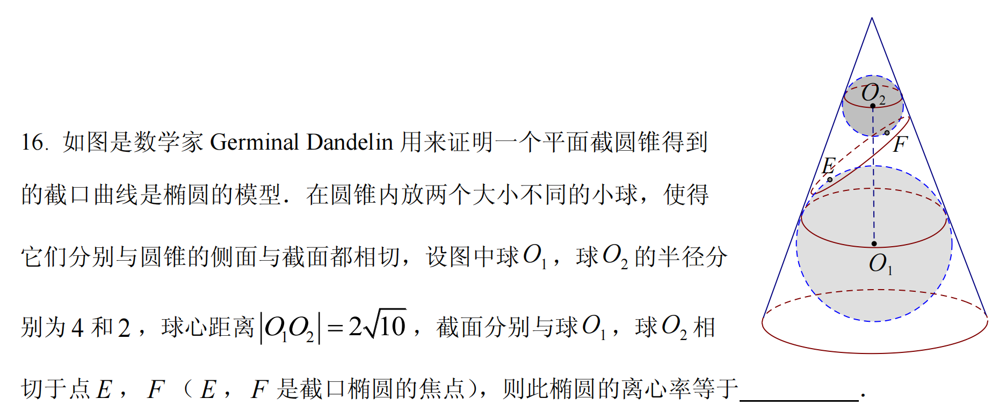

# 椭圆杂谈

本期内容：

- 使用物理方法证明开2：绕日运动轨迹为椭圆
- 有趣结论：离心点到圆周线段中垂线围成椭圆
- 使用有趣结论证明开2
- Dandelin球证明切圆锥切出椭圆

整理自摸鱼时 B 站看到的一些内容。

## 物理方法证开2

引入角动量 $\vec{L}=m\vec{r}\times \vec{v}$。标量：$L=mrv\sin \theta$，$\theta$ 为位矢与速度夹角。$v\sin \theta$ 记为 $v_p$ 表示垂直方向的速度。

有 $r=\dfrac{L}{mv_p}$。如果能用 $\theta$ 表示出 $v_p$，就能写出极坐标式了。

微分得 $v_p=\dfrac{rd\theta}{dt},d\theta=\dfrac{Ldt}{mr^2}$。根据万有引力公式，$\vec{a}=\dfrac{d\vec{v}}{dt}=-\dfrac{GM}{r^2}\dfrac{\vec{r}}{r}$。

因此 $\dfrac{d\vec{v}}{d\theta}=-\dfrac{GM}{L}\dfrac{\vec{r}}{r}$。设 $k=\dfrac{GM}{L}$， $=-k\dfrac{\vec{r}}{r}$。其中 $\dfrac{\vec{r}}{r}$ 为方向上的单位向量，就是 $(\cos\theta,\sin\theta)$

水平方向上，$v_x(\theta)'=-k\cos \theta$，$v_x(\theta)=-k\sin \theta+c_x$。

竖直方向上，$v_y(\theta)'=-k\sin \theta$，$v_y(\theta)=k\cos \theta+c_y$。

因此 $\vec{v}=k(-\sin\theta,\cos\theta)+\vec{c}$。

考虑在右端点时，$\vec{v}$ 方向为竖直向上/竖直向下，没有水平分量。此时 $\vec{v}=(0,k)+\vec{c}$。因此 $\vec{c}$ 也没有水平分量。设 $\vec{c}=(0,y)$。

记 $\vec{n}=(-\sin \theta,\cos\theta)$。它和 $\vec{r}$ 垂直并且模为 $1$。所以 $v_p=\vec{v}\cdot\vec{n}=k(\sin^2\theta+\cos^2\theta)+y\cos\theta=k+y\cos\theta$。

发现我们表示出了 $v_p$。从而有 $r=\dfrac{L}{mk+my\cos\theta}$。很明显这个是椭圆的极坐标式。稍微化一下得到

$$
r=\dfrac{L^2/GMm^2}{1+(y/k)\cos \theta}
$$

其中离心率 $e=y/k$。当 $e<1$ 时为椭圆，$e=1$ 为抛物线，$e>1$ 为双曲线。这个 $e$ 好像还和能量有关。这里略。

这里的 $y$ 不是确定的，和行星初始位置和速度有关。

## 有趣结论

对于一个圆 $A$，取圆内非圆心一点 $B$。$B$ 向圆上点发出无数条线段，每条线取中垂线，这些中垂线围成一个椭圆。

“围成”听起来很感性，换成严谨的描述是：存在一个椭圆，使得对于任意圆上的点 $C$，$BC$ 连线的中垂线和椭圆相切。

<video id="video" controls preload="auto" style="zoom: 50%;"><source src="./img/数学补充_椭圆杂谈/vid1.mp4"/></video>

画出图来不难发现 $A,B$ 就是椭圆的焦点，而且这根中垂线“卡在椭圆上动”。

证明也很容易。设中垂线与 $AC$ 交点为 $D$，则 $AD+AB=AD+DC=AC$ 为定值，并且中垂线上其它点的距离都 $>AC$，从而在椭圆外。因此中垂线与椭圆切与 $D$ 点。每个中垂线都相切，因此必然围成一个椭圆。

过 $D$ 点作 $BC$ 的平行线，可以证明椭圆的光学性质。

把 $B$ 放到圆外面去，这些中垂线会形成双曲线，其焦点为 $A,B$。

## 使用有趣结论证明开2

在 【物理方法】 中，我们得到 $\vec{v}=k(-\sin\theta,\cos\theta)+\vec{c}$。很明显这是一个以 $\vec{c}$ 为圆心，$k$ 为半径的圆。

也可以用 角动量守恒 $\Leftrightarrow$ 掠面速度恒定 来得到这个结论。

画出上图。设当前角为 $\theta$， $C=O+\vec{c}$，$A=O+\vec{v}$。根据上式， $CA$ 与 $y$ 轴夹角为 $\theta$。

显然，对于两个点，如果任意时刻速度（包括初速度）相同，那么两个点轨迹必然是相同的。

我们现在知道了 $\theta$ 角时的速度，尝试构造出一个轨迹。

根据有趣结论，我们把 $\vec{OA}$ 绕其中点 $M$ 转 $90\degree$，得到 $O'A'$，如图。这个 $O'A'$ 与一个以 $O,C$ 为焦点的椭圆相切。

保持大小不变，以 $\vec{O'A'}$ 作为速度，这个椭圆就是它的运动轨迹。但问题是 $\vec{O'A'}$ 和原来速度有个夹角，怎么办？

很简单，把这张图整个顺时针转 $90\degree$，方向就又相同了。这个轨迹中，任意位置速度和原来的速度大小方向完全一致。它的轨迹是椭圆，从而原来轨迹是椭圆。QED。

## Dandelin球

今天刚在 B 站看完，数学老师就在群里发了个题来。反向大数据了属于是。直接看题吧。

我们先考虑这个为什么能证明截面是椭圆。首先我们声明，$E,F$ 就是椭圆的焦点。

对于椭圆上任意一点 $A$，$AE$ 就等于在侧面上 $A$ 到 $O_1$ 切点的距离。假设切点是 $C_1$，我们发现 $AC_1$ 和 $AE$ 都是球的切线，而所有切点距应该都相等（根据对称性），所以 $AC_1=AE$。同理作 $C_2$，$AC_2=AF$。

$AE+AF=AC_1+AC_2=C_1C_2$，为侧面上两个切点的距离，是定值。从而截面为椭圆。

本题需要定量计算，需要画图。三维空间不方便画图，我们画出侧视图如下。

如图，截面即 $AB$，两个球变成两个圆 $O_1,O_2$。$E,F$ 是两个焦点。 

建系，设 $O_1$ 在原点，则 $O_2(0,2\sqrt{10})$。顶点 $S$ 作出来的线要同时和两个圆相切。根据相似，$C_2O_2:C_1O_1=1:2=SO_2:SO_1$。从而 $S(0,4\sqrt{10})$。

设 $\alpha=\ang C_1SO_1$。容易发现 $\tan\alpha=\dfrac{1}{3}$，$\alpha$ 在一个 $1:3:\sqrt{10}$ 的 $Rt\triangle$ 中。

因此 $2a=C_1C_2=O_1O_2\times \dfrac{3}{\sqrt{10}}=6$。

接下来考虑求 $EF$。连接 $O_1E,O_2F$。$O_1E+O_2F=6$。而这个东西等于 $O_1O_2$ 在 $\vec{O_1E}$ 方向上的投影长。设 $\beta=\ang EO_1O_2$，计算发现 $\beta=\alpha$。接下来就好做了。把 $EF$ 分成 $y$ 轴左边的和 $y$ 轴右边的。左边长：$O_1E\times \tan\alpha=\dfrac{4}{3}$，右半边是 $\dfrac{2}{3}$，$EF=2=2c$。

算出来离心率 $e=\dfrac{2c}{2a}=\dfrac{1}{3}$。
