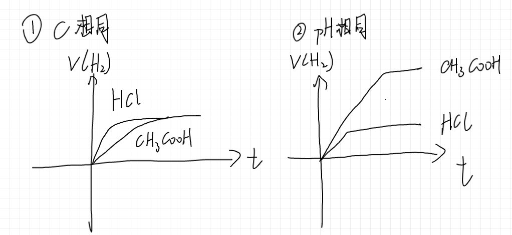

# 化学笔记

# 选择性必修 1

## 化学反应的热效应

### 概念

这一部分我们研究化学反应中能量的变化。这一章是热能，下一章是电能。

能量为什么会变化呢？我们知道，化学物质具备一定的能量，就是化学能。化学反应前后，物质的化学能不一定相同。如果化学能有差别，根据能量守恒定律，差的这些化学能就会以别的形式释放或者吸收，通常表现为吸热和放热。

化学反应导致热量变化的效应叫做热效应。根据热效应是放热还是吸热，将反应分为放热反应和吸热反应。

- 放热反应：燃烧，中和等
- 吸热反应：$\ce{C + CO2,Ba(OH)2 * 8H2O + NH4Cl}$，盐和弱酸弱碱的水解

**反应热**：当反应物和生成物具有相同的温度时，吸/放的热为反应热

恒压时，反应热即为焓变 $\Delta H$。单位： $\rm{kJ/mol}$。

$\Delta H>0$ 表示吸热，否则放热。

**键能**：化学键 **断键** 需要的能量。严格的说是 $\rm 101kPa,298K$ 条件下，$\rm 1\ mol$ 气态分子 AB 生成气态原子 A 和 B 的过程中所吸收的能量。

**断键吸热，成键放热**。$\Delta H=-\Delta 总键能 = \Delta 总内能$。

注：对于可逆反应，其 $\Delta H$ 表示完全进行时的焓变。并且逆反应的 $\Delta H$ 为负。

**热化学方程式**：体现反应吸热放热情况。需 **标注状态和焓变**。例如，
$$
\ce{2H_2(g) + O2(g) = 2H2O (l)} \quad \Delta H=\rm{-571.6kJ/mol}
$$
**中和热**：$\ce{H+(aq) + OH-(aq) = H2O(l)}\quad \Delta H=\rm{-57.3kJ/mol}$；需要记住 **数值和条件**。

条件：强酸强碱；不成沉淀；稀溶液。

原因：弱酸弱碱水解会吸热；形成沉淀放热；浓硫酸（等浓溶液）遇水放热。

进行中和热测定实验，误差来源：1. 测量误差；2. 散热损失。

**标准燃烧热**：$\ce{101 kPa,1mol}$ 物质生成稳定物质放出的热。**是负数**。单位 $\rm kJ/mol$。

稳定物质：$\ce{N\to N2;S\to SO2;C\to CO2;H\to H2O(l);...}$

**盖斯定律**：反应无论是分步进行，热效应和总反应相同。$\Delta H(A\to C)=\Delta H(A\to B)+\Delta H(B\to C)$。

根据这点，可以通过加加减减计算出某反应的焓变。**注意：反应拼在一起的时候需要重新配平。** 

### 考试重点

首先要小心题意里的坑。然后别算错了，这一章的计算挺多的。

【一】易错概念

- 标准燃烧热：首先物质是 $\ce{1mol}$，而且水必须是 **液态**。看到 $\ce{H2O(g)}$ 直接排除。
- 中和热：必须只发生强酸强碱中和，不能有沉淀气体弱电解质。
- **断键吸热，成键放热**

【二】重点技巧

- 利用键能计算反应焓变。注意：数清楚各种键的数量，并看好题目中具体说明某物质中含的是什么键。
- 利用盖斯定律计算反应焓变。注意重新配平，看好是正的还是反的，在此基础上尝试拼出要求反应。
- 活化能：如果题目中给出中间能量变化，活化能就是需要跨过的最高的差值，就是找“最陡的坡”。若默认只有一步反应且已知 $\Delta H$，则能量低的一方活化能高，且两边活化能的差就是 $\Delta H$。很明显，从山脚上山肯定比从山腰上山爬的高。活化能越大，反应越慢，反之亦然。

## 化学能与电能的转化

### 原电池

电能来自哪里？

氧化还原反应中，会有电子的转移，由还原剂给氧化剂。此时，我们在它俩中间接一根导线，电子就不直接给氧化剂，而是会从我们的导线里走了。此时电流就产生了。在电池中，正电荷从正极出发，然后回到负极。电子和正电荷相反，因此电子从负极出发回到正极。结合上述分析发现，

**还原剂是负极，氧化剂是正极**。

在产生电流作用下，阳离子流向正极，阴离子流向负极。

原电池：能够实现化学能->电能转化的装置。

电池反应：可分为两部分，一部分是负极失电子的反应，一部分是正极得电子的反应。如 Zn-Cu 原电池的反应：

- 负极：$\ce{Zn - 2e- -> Zn^{2+}}$
- 正极：$\ce{Cu^2+ + 2e- -> Cu v}$ 
- 总反应：$\ce{Zn + Cu^2+ -> Cu + Zn^2+}$

要记住的反应：铅蓄电池 $\ce{Pb + PbO2 + 2H2SO4 <=>[放电][充电] 2PbSO4 + 2H2O}$

能直接进行的是放电过程。很明显 $\ce{PbO2}$ 强氧化性，$\ce{Pb}$ 有还原性，肯定左往右是放电。而看起来需要 “逆天” 进行的反应就是充电的，即右到左。

概念：一次电池/二次电池：就是不能/能充电的意思。

### 电解池

和原电池不同的是，它 **外加一个电源**。这是区分电解池和原电池的方法。

电解池中，阴极给出电子，阳极吸取电子。可以看成阴极是强还原剂，阳极是强氧化剂。

从而 **阴极发生还原反应，阳极发生氧化反应**。

电解时，在电流作用下，阳离子朝阴极移动，阴离子朝阳极移动。溶液中存在多种能电解的离子时，存在优先级顺序。

阳离子：$\ce{Ag+>Fe^3+>Cu^2+>H+>Fe^2+ \cdots >Na+}$。按氧化性递减。

阴离子：$\ce{S^2- > I- > Br- > Cl- > OH- \cdots > F-}$。按还原性递减。

通常当电极本身能反应时，会 **覆盖** 电解池里的反应而优先反应。电解池里暂时就不反应了。

### 考试重点

这一部分要小心读题。有时题目会告诉你电极产物，没看到就会写错；有时题目会告诉你环境 $\ce{pH}$，而且很可能是暗示，此时一个不注意分就全没了。

【一】二者的判断

- 有外接电源的是电解池，否则是原电池
- 当两个池直接接在一起的时候，反应能自然发生的池便是原电池，否则是电解池
- 对于二次电池，充电时相当于电解池，放电时相当于原电池。这种题目没啥好办法，就是当成电解池和原电池做两遍并判断选项。注意此时有结论：阴极=负极，阳极=正极，一定是对应的。

【二】原电池相关

- 需要氧化还原部分内容足够熟练 
- 电极判断：找还原剂，它就是负极（或者你找氧化剂也可以）
- 方程式书写：总反应好写；电极反应需要判断出正/负极的还原/氧化产物。
- 选择题中判断这个那个，例如下面的离子交换膜，以及 **产物判定**（重点），或者定量计算（如计算电子转移），一般把电极反应式写出来就都了然了，不知道怎么判定的时候就先尝试写方程式。
- 千万注意 **酸碱性**，以及 **aq还是l**（即溶液中还是熔融态）。不同环境中，产物不同。例如氧化 $\ce{CH4}$ 的电池，酸性中是 $\ce{CO2}$，碱性中是 $\ce{CO_{3}^{2-}}$，熔融态也是 $\ce{CO2}$ 但注意传导的是 $\ce{O^{2-}}$，熔融碳酸盐中则是传导 $\ce{CO3^{2-}}$ 并生成 $\ce{CO2}$
- **离子交换膜**：作用是分开两边产物，使得产物纯，并且不会接触产生问题。这两大作用看情况写，不一定全有。判断离子移动方向，就根据电荷守恒判定。此时建议写出方程式。

【三】电解池相关

- 电极判断：找谁被氧化了，这里是阳极 （阳极相当于强氧化剂，阴极相当于强还原剂）
- 方程式书写：判断出氧化/还原产物即可。和原电池部分类似，先把电极反应写出来后，就容易判断选项了。
- $\ce{pH}$ 变化：放氢，$\ce{pH}\uparrow$；放氧，$\ce{pH}\downarrow$。方程式取决于环境 $\ce{pH}$。同样，电解池也要注意环境 $\ce{pH}$
- 离子交换膜：阳离子往阴极跑，阴离子往阳极跑。作用同原电池部分。

【四】生活相关应用

- 腐蚀：生活中金属锈蚀多数是电化学腐蚀
- 保护：通电，被保护的接阴极；不通电，牺牲活动性高的金属，作为原电池阴极。
- 电镀：被镀的放阴极，因为表面生成金属是还原反应
- 精炼：看成自己镀自己；粗产品放阳极，精炼品放阴极。

## 化学反应平衡

### 反应速率

反应速率 $v(B)=\dfrac{\Delta c(B)}{\Delta t}$ ，$B$ 为某种物质。常用单位 $\rm mol/(L\cdot s)$。它表示的是 **平均速率**。

> 有时在描述气体反应时用压强变化 $\dfrac{\Delta P}{\Delta t}$ 描述反应速率。

比较反应速率：换算到同一物质，同一单位。

影响：

- 内因：本身性质
- 外因：浓度，温度，压强，催化剂，接触面积...

概念：活化能 = 活化时分子的平均能量 - 分子总能量。

活化能越大，越难进行反应。使用催化剂可以降低活化能。

【坑点】做题时 **注意单位**，有些地方可能是 $\rm mol/(L\cdot min)$，也有些地方会用 $\rm \mu mol/(L\cdot s)$。

### 反应的方向

吉布斯自由能 $\Delta G=\Delta H-T\Delta S$。当 $\Delta G<0$ 时，反应可以自发进行。$\Delta S$ 表示熵变，越混乱熵越大。其单位为 $\rm kJ/(mol\cdot K)$。$\rm K$ 为开尔文，和 ℃ 大小相同但值多 $273.15$。

- $\Delta H<0,\Delta S>0$ 必然能自发；$\Delta H>0,\Delta S<0$ 必然不能自发
- 否则，若 $\Delta H<0,\Delta S<0$，则 $T$ 小时自发。反之 $T$ 大时自发。

判断 $\Delta S$：通常气体\>液体=离子\>固体。一般在题目中出现的 $\Delta S$ 都比较显然，或者需要通过反应能否自发进行与 $\Delta H$ 结合判断 $\Delta S$。

### 反应平衡

可逆反应：相同条件下，正逆都能进行的反应。

特点：同时发生，进行不完全，生成物与反应物同时存在。

**平衡**：一定条件下的可逆反应中，正逆同速，形成动态平衡。

特点：

- 各成分的 $n,c$ 不变
- 反应并非不发生，而是相互抵消了影响
- 此时 $v_{正}=v_{逆}$
- 当条件改变时，平衡被打破，重新建立新的平衡。该过程被称为 **平衡的移动**。

平衡常数 $K$：对于 $\ce{aA + bB <=> cC + dD}$，平衡时 $\dfrac{c(C)^c c(D)^d}{c(A)^ac(B)^b}$ 为定值，被称为平衡常数，记为 $K$。有单位，不用写。

$K$ 越大，正反应进行的越彻底。$K$ **只** 在温度改变时改变，其他均不能改变 $K$。

浓度商 $Q_c=\dfrac{c(C)^c c(D)^d}{c(A)^ac(B)^b}$。与 $K$ 的式子一样，但 $K$ 描述的是 **平衡时** 的浓度商。若 $Q_c<K$，说明正反应速率大，平衡正向移动；否则平衡逆向移动。

其它平衡常数：对于气体反应，常见的有压强平衡常数 $K_p$，为平衡常数的式子中把 $c$ 换成分压 $p$。由于 $p_0V=n_0RT$（$p_0,n_0$ 表示气体总的压强、物质的量），同时乘以体积分数然后把 $V$ 移过去，发现对于成分 $X$， $p(X)=c(X)RT$，即 $p$ 和 $c$ 的比是一个常数且只和温度有关，和压强无关。从而压强平衡常数也是一个只受温度影响的平衡常数。

反应速率常数：正反应速率 $v_正=k_正 c(A)^ac(B)^b$，$v_逆=k_逆c(C)^c c(D)^d$。由代数关系知 $K=\dfrac{k_正}{k_逆}$。根据这个就知道为什么拿 $Q_c$ 和 $K$ 比较就可以知道正逆反应谁快了，也能发现加入反应物时正反应速率增加而逆反应速率不变。

**勒夏特列原理**：改变某一条件时，平衡会向着 **减弱** 这一影响的方向移动，并且 **不会完全抵消** 该影响。

> 注：后半句不一定完全对。
>
> 例如反应 $\ce{A(s) <=> B(s) + C(g)}$。这个平衡常数只和 $c(C)$ 有关。恒容时，则平衡时 $n(C)$ 不变。因此，如果增加 $C$ 的量，平衡的确向左移动，但平衡后 $n(C)$ 不变。此时这个影响被完全抵消了。
>
> 用 $K$ 不变分析是对的。温度不变 $K$ 不变在高中阶段是绝对正确的。
>
> 反应 $\ce{aA(g) <=> bB(g)}$ 是另一个特殊情况。恒温恒容，达到平衡时，再加入 $\ce A$，转化率如何变？答：$a>b$ 增大，$a=b$ 不变，$a<b$ 变小。同样可以用 $K$ 不变分析，也可以用 “拍扁两个盒子法” 分析。

### 等效平衡

等效平衡：对于同一个反应，在不同条件下达到两个平衡，若平衡时各成分浓度相同（此时质量分数，体积分数，分压...等均相同）

等同平衡：在等效平衡的基础上，各成分物质的量也相同。等同平衡属于特殊的等效平衡。

**实验证明，化学反应平衡从正反应和逆反应开始建立是等效的。**

例如：$\ce{N2(g) + 3H_2(g) <=> 2NH3(g)}$。

加入 $\ce{1mol N2,3mol H2}$ 和 加入 $\ce{2mol NH3}$ ，建立的平衡等效。此时也是等同的。

为方便说明，后面用数对来依次描述化学式中各成分的量，从左到右，单位 $\rm mol$。例如上述反应中 $(1,3,0)$ 表示 $\ce{1mol N2,3mol H2,0mol NH3}$。

等效平衡的使用分三种情况

1. 气体化学计量数和不相同，恒温恒容：**等值**

   此时，都转化为反应物/生成物后，必须完全相同，才能建立等效平衡。此时的等效平衡是等同的。

   例如，$\ce{N2(g) +3H2(g) <=> 2NH3(g)}$ 中，$(1,3,0)$ 与 $(0,0,2)$ 等效，而和 $(0,0,4)$ 不等效。

   此时无法建立不等同但等效的平衡。

   > 为什么 $(0,0,4)\neq (0,0,2)$：
   >
   > $(0,0,4)$ 可以看做是 $(0,0,2)$ 的体积被压缩到一半。此时压强增大，平衡向右移动。因此 $(0,0,4)$ 的平衡中 $\ce{NH3}$ 的含量高于 $(0,0,2)$ 的平衡。
   >
   > 这也解释为什么气体化学计量数和相同时可以等比：如果有倍数差距，可以看成减小/增大体积，而此时的压强变化不会使平衡移动，从而等比的平衡也是等效的。

2. 气体化学计量数和不相同，恒温恒压：**等比**

   根据 $PV=nTR$ ，$c=n/V=\dfrac{P}{TR}$ 为定值。此时只需要转化为生成物/反应物后等比就行。

   同样是上述反应，$(1,3,0)=(0,0,2)=(0,0,4)$。但是此时 $(1,3,0)\neq (1,4,0)$

3. 气体化学计量数和相同：**等比**

   例如 $\ce{H2(g) +I2(g) <=> 2HI(g)}$。气体数不变。

   容易发现，无论是恒容还是恒压，只要转化后等比，就是等效的平衡。

   例如此时 $(1,1,0)=(2,2,0)=(0,0,4)$。

例题：现在有反应 $\ce{mA(g) + nB(g) <=> cZ(g)}$。以 $m:n$ 的比投料 $A,B$，通过实验得到不同条件下反应达到平衡时 $Z$ 的物质的量分数 $\varphi(Z)$。分析 D 选项：恒温恒压时，向已达到平衡的反应体系加入少量 $\ce{Z(g)}$，再次平衡后 $\varphi(Z)$ 增大。

D错误。 转化为生成物，一开始相当于加入了若干 $Z$；继续加若干 $Z$ 相当于一开始多加了点 $Z$。根据恒温恒压时的分析，此时显然是等比的，因此平衡等效，$\varphi(Z)$ 不变。

### 考试重点

这一部分首先计算复杂，题型多变，并且还要小心单位等处处存在的陷阱；大题夹杂着图像和数据，复杂程度更上一层，稍微出难点就能干掉一片。基本上是高中化学最难的内容。

这一部分需要大量刷题提升基本功，从而在复杂的考场环境中还能冷静的解决一道恶心至极的平衡大题，还不算错也不看错。

【一】概念

- “平衡移动”表示反应在向某个方向进行，与 “平衡常数改变” **不是一回事**。
- 改变某一个条件，如果平衡正向移动，当然正反应速率增加，但逆反应速率不一定减小，也可能不变或者增加的慢
- - 例如加热，正反应和逆反应速率 **都增加**；具体哪边加的多用平衡移动判断，如果正向移动则正反应增加的更多。加反应物时，正反应速率增加，逆反应速率不变，平衡正向移动
- - 加催化剂，正反应和逆反应速率同时增加且 **增加倍数相同** ，因此不会影响平衡常数，也不会改变平衡移动的方向，它只能让反应更快的达到平衡。看到 “催化剂....影响平衡产率/平衡转化率” 必然错误。
- 单位！有的时候反应速率会有 $\ce{mol/(L * min)}$；有的时候熵变的单位是 $\ce{J/(mol * K)}$ （焓变是 $\ce{kJ}$）。做题先把单位划一划并确认一遍是个好习惯。
- **千万小心固体**！看到 $\ce{(s)}$ 就划出来。它直接没有浓度概念。因此不能描述反应速率，平衡常数里也没这一项，并且加固体也不会影响平衡移动，也不会影响反应速率。
- 所有改变条件的影响，本质都是对 **浓度** 的影响，压强也是。加压导致的移动本质上是体积减小导致的 $c$ 的变化。因此，恒容时加 $\ce{He,Ne}$ 等虽然会增大压强，但不改变总体积和 $n(生成物/反应物)$，从而所有的 $c$ 都不变，不影响平衡（或者说，分压不变）。

【二】平衡移动 定性判断与定量计算

- 首先要看好：**恒温恒容还是恒温恒压**，以及恒温还是绝热。绝热就是反应的反应热也会影响反应，例如使平衡移动或者影响速率。
- 温度不变时，**平衡常数一定不变**，无论如何都不变。凭这个可以排除不少选项。这也是分析的有力依据，可判断平衡移动的方向。
- 温度改变，平衡移动方向：$\Delta H$ 结合勒..原理判断。大题中也可结合图表判断。
- 定量计算：**三段式**；初始多少，平衡时多少，变化多少。根据这个列出方程，求解某个成分的含量，或者求平衡常数。不要嫌麻烦，老老实实用这个办法算，凭感觉随便算很容易出错。尤其注意当总体积（以及别的类似的量）发生变化，比如分压相关计算，一定要依照定义，小心谨慎的算。想当然的算很容易出错。
- 定量计算与定性判断中，等效平衡是一个简便方法，但要注意结论记得清楚。当你觉得结论记不清楚的时候，在草稿纸上默写一遍，发现默不出来，老老实实用 $K$ 不变分析，免得出错。
- 涉及多个反应的定量计算：可以设每个反应发生了多少 $\ce{mol}$，结合初始量可以得到每个元素的量，然后根据各种条件（如平衡常数，或者某成分最终含量多少）列方程求解即可。

【三】大题相关

- - 选择性，产率，转化率：假设研究的反应物为 $A$，主反应生成 $B$，有副反应生成 $C,D$ 等；有：
  - 转化率=转化的 $A$ 占总 $A$ 的比
  - 产率=生成 $B$ 所需的 $A$ 占总 $A$ 的比（等价描述为，实际产出的 $B$ 比上理论最大产，理论最大产就是假设总的 $A$ 全产生 $B$ 产出多少 $B$）
  - 选择性=生成 $B$ 所需的 $A$ 占转化的 $A$ 的比
  - 选择性可以描述副反应程度大小，选择性高则副反应进行的少；注意到选择性=产率和转化率的比
  - $K$ 增大时，平衡转化率和产率都增大，选择性要看副反应如何。一般规律是：温度高是，容易发生副反应
  - 实际做题
- 学会读图：从图像中看出变化趋势，以判断 $\Delta H$ 之类；代入图像中的数据进行定量运算，见上面。
- 工业上选择恰当的条件并非总是产的越多越好，比如提高温度，如果已经足够高了，再提高不仅产率不会高多少而且耗能会大量增加，肯定不会选择继续提高。压强同理，维持高压的能耗和成本也很高。因此工业上会在产率和成本间折中取最优方案。
- 很多时候，“选用合适催化剂”是个万能答案，它也可以提升选择性减少副反应，也可以让相同时间内转化率和产率提高。尤其当题目说 “压强和温度一定时”，基本只能从这个角度写答案了。
- 产率随着温度增加，先上升后下降：因为一般工业上是反应一定时间，不一定能平衡；前期温度升高能让反应加快并且让催化剂活性增强，从而会先上升；后面足够快了，能到平衡了，如果 $\Delta H<0$，温度就会让平衡左移从而产率下降。“先上升后下降” 一般都是这种两个因素竞争影响的情况。
- 曲线变化的原因：结合各种角度分析，一般有 加压/减压，升温/降温，加/减生成物/反应物等，代入看看是否有可能。很考验平衡移动的定性分析能力，不仅要足够快还不能失误。

## 水中的离子反应平衡

### 弱电解质电离平衡

弱电解质的电离也存在反应平衡。基本上和化学反应平衡一样。

平衡常数：类似反应平衡，用 $c$ 的指数的比描述。对于弱酸，我们用 $K_a$ 表示；对于弱碱，用 $K_b$ 表示。（a,b表示acid，base）

$K$ 越大反应进行的越彻底。因此 $K_a$ 大的就是强酸，$K_b$ 大的就是强碱。定量比较酸碱性就用 $K_a,K_b$ 。

对于多元酸，电离分步进行。每一步的平衡常数用 $K_{a1},K_{a2}...$ 表示。分析时，有时把部分酸式根也看做酸来做。

> 例：$\ce{NaClO + CO2 + H2O -> ?}$
>
> 已知：$\ce{K_{a2}(H2CO3)<K_a(HClO)<K_{a1}(H2CO3)}$。
>
> 相当于酸性大小：$\ce{HCO3- <HClO<H2CO3}$
>
> 因此，无论 $\ce{CO2}$ 多或少，均只能生成 $\ce{NaHCO3}$，而不能生成 $\ce{Na2CO3}$。因为生成 $\ce{Na2CO3}$ 需要发生如下反应：
>
> $\ce{NaHCO3 + NaClO -> Na2CO3 + HClO}$
>
> 而 $\ce{HCO3-}$ 酸性小于 $\ce{HClO}$ 酸性，因此这个不能发生。

弱酸的性质（与强酸对比，以醋酸和盐酸为例）

- $c$ 相同时，电离出的 $\ce{H+}$ 量远远小于强酸；此时与足量 $Zn$ 反应，速率远小于强酸，但放出氢气总量相同。
- $\rm pH$ 相同时，其 $c$ 远远大于强酸。此时与足量 $Zn$ 反应 **又快又久**。快是因为它一边消耗一边就有补充（平衡右移不断产生 $\ce{H+}$），而盐酸的 $\ce{H+}$ 没了就没了，所以它一直很快但盐酸会不断变慢。

水的电离：其平衡常数可描述为 $\ce{c(H+)\cdot c(OH^-)}$。在任何水或水溶液中（即包括酸碱盐溶液），一定温度下，它都是定值。记为 $K_w$。$\rm 298K$ 时，它是 $10^{-14}$。它被称作 **离子积常数**。

$\rm pH$ 的定义为：$\rm -\lg c(H^+)$，$c$ 取单位 $\rm mol/L$。例如，某溶液中 $\rm c(H^+)=10^{-2} mmol/L$，则它的 $\rm pH=5$。（注：换算到 $\rm mol/L$ 算）。如果同理定义 $\rm pOH$，则有 $\rm pH+pOH=14$。

> 注：$\lg 2\approx 0.3,\lg 5\approx 0.7$。计算很实用。

温度升高时，$K_w$ 也升高。$\rm 373K$ 时（即 $\rm 100\degree C$），$K_w=10^{-12}$。

酸碱都抑制水的电离。例如加入 $\ce{0.01 mol/L H+_}$ 的酸时，水电离的 $\ce{H+,OH-}$ 只有 $\ce{10^{-12} mol/L}$（注：实际上得解个二次方程，略小于 $10^{-12}$，但误差极小，忽略不计）。已知水电离的 $\ce{H+/OH-}$ 浓度为 $\ce{10^{-x} mol/L}$ 时，加入的可能是酸或碱，$\ce{pH}$ 为 $x$ 或 $14-x$。

溶液的酸碱性本质是比较 $\ce{H+,OH-}$ 相对大小。$\ce{pH=7}$ 只在常温下是中性，温度升高时可能是碱性。

混合溶液 $\ce{pH}$ 计算：先判断 $\ce{H+,OH-}$ 哪个多，然后计算它多出来了多少，按这个计算 $\ce{pH}$。

### 酸碱中和滴定

 滴定管：一种精密仪器，是很长的管，上面是0刻度线，下面是最大的刻度，最大的刻度下面和0刻度上面均有一小块空间。最下面是尖嘴。分为酸式滴定管和碱式滴定管，区别为尖嘴处不同。滴定管的精度可达小数点后两位。

注：

- 必须写两位；选择题中 “滴定，测得...为 20.0mL” 错，要写 20.00mL

- 同容量瓶，除非未知，写仪器必须写 “...mL 酸式/碱式滴定管”

酸式：尖嘴处为玻璃活塞；原因：一般酸性物质与玻璃不反应，但碱性物质会和玻璃反应形成硅酸盐沉淀造成堵塞。它也可以装大部分氧化性物质。注：不能装 $\ce{HF}$ 因为 $\ce{4HF(aq) + SiO2(s) -> SiF4(aq) + 2H2O(l)}$

碱式：尖嘴处为橡胶管，内部有玻璃小球。原因：橡胶耐碱，但是不耐酸和氧化性物质。使用时把橡胶捏起来形成小缝让液体通过。

应用：通过已知浓度的溶液（标准液；容量瓶配置），根据反应测得某未知溶液浓度。不仅可以是酸碱中和，也可以是氧化还原，如高锰酸钾滴定草酸。

操作：

1. 首先准备好各种仪器，用容量瓶配置标准液；水洗锥形瓶和滴定管
2. 滴定管：先水洗，洗净后用要放进去的 **标准液/待测液润洗**；放液体前，先 **排净尖嘴里的气泡**（把液体加到0刻度线以上一点然后放掉）
3. 用滴定管取一定量标准液，放入洁净锥形瓶中；滴1~2滴指示剂
4. 开始滴定：先记下标准液所在滴定管初始读数；逐滴加入标准液，边加入边搅拌，视线盯着锥形瓶观察；到达滴定终点时停止滴定，记下此时的读数。
5. 到达滴定终点的现象：加最后半滴标准液，溶液由xx色变为xx色，**且半分钟内不变色**
6. 两次读数相减即为消耗的标准液体积

计算：标准液浓度为 $c_0$，待测液浓度为 $c_x$。待测液取了 $V_0$ 体积（事先决定了），测得标准液消耗了 $V$ 体积。则 $c_x=k\dfrac{c_0V}{V_0}$。

其中 $k$ 为反应系数比，为某个常数。注意到 $c_0,V_0$ 均为事先确定的，关键性的量就是消耗标准液体积 $V$。这个 $V$ 等于滴定终点读数 - 滴定开始前读数。

误差分析：只需要看 $V$ 如何变化 （注：未知滴定已知的情况和下面完全相反）

- **锥形瓶中有水：不影响**。它会改变做实验时待测液体积，但我们的 $V_0$ 并不是实验中测而是事先决定的，最后计算也是代入这个 $V_0$ 算；$V$ 取决于待测液中溶质的 **物质的量**，加水也不改变这个；因此锥形瓶中有水不影响。不仅不润洗没事，往里加水也没事。因此滴定时滴到瓶壁上可以用水冲进去，滴到外面只能重做实验了。
- 俯视/仰视读数。滴定前俯视/滴定后仰视：偏大；滴定前仰视/滴定后俯视：偏小（考虑读数差的变化）
- （标准液）没有排气泡：**偏大**。加进去的 $V$ 一部分用来排气泡了，只剩一半用来反应，因此我们测得的 $V$ 大于实际反应的 $V$，从而偏大。（相反，取待测液滴定时若没有排气泡，偏小）
- 标准液滴定管残留有水且没用标准液润洗：**偏大**。标准液被稀释，导致需要更多 $V$ 才能完全反应，从而偏大。

指示剂变色pH：

- 按道理滴定终点应该是到 $\rm pH=7$，但一般指示剂都不是在恰好为 $7$ 时变色。
- 但是到达终点后，加一滴对 $\rm pH$ 的影响都是很大的。加一滴（约0.05mL）酸/碱，pH能变到 4/10。因此只会有一滴的误差。
- 理论上，变色范围越接近 $7$，用这种指示剂误差越小。但也要考虑到变色是否明显。石蕊变色范围大且变色不明显，一般酸碱中和滴定中 **不用石蕊**。

### 考试重点

【待更新】
