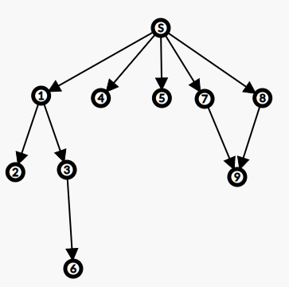
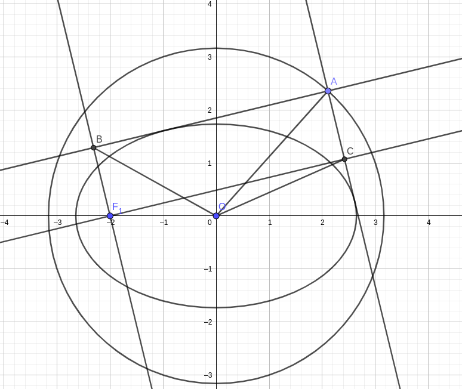

# 数学笔记

与其它笔记不同，这里按照主要知识点划分板块，而不是按书划分

# 圆锥曲线

按内容的依赖关系描述。除基本定义和极线部分内容外，每个内容都有证明。简单的证明会简略一些。

这个“依赖”并非硬性的。事实上，你全都用代数法硬推也不是不可以。只不过按照“依赖”来推会轻松一些。

当前依赖关系示意图

## Start

基本定义。

椭圆：$\dfrac{x^2}{a^2}+\dfrac{y^2}{b^2}=1(a>b>0)$。$c=\sqrt{a^2-b^2}$。离心率 $e=\dfrac{c}{a}<1$。

抛物线：$y^2=2px(p>0)$。离心率 $e=1$。

双曲线：$\dfrac{x^2}{a^2}-\dfrac{y^2}{b^2}=1(a>0,b>0)$。$c=\sqrt{a^2+b^2}$。离心率 $e=\dfrac{c}{a}>1$。

这三种都是横过来的。竖过来只需交换 $x,y$ 即可。

若无特殊说明，下面讨论曲线默认按这三种方程讨论。即我们默认都在 $x$ 轴上且抛物线开口向右。

通径：过焦点垂直于对称轴作垂线，交曲线于 $AB$ 两点，$AB$ 为通径。通径长度的一半记为 $p$。对于抛物线来说就是它参数的那个 $p$。对于椭圆和抛物线，不难算出 $p=\dfrac{b^2}{a}$。*先记着，后面有用*。

椭圆的另一个理解：半径为 $1$ 的圆，$x$ 拉伸 $a$ 倍，$y$ 拉伸 $b$ 倍，得到。应用：椭圆面积为 $\pi ab$。

## ①焦半径

依赖：Start

对于曲线上的点 $P$，$P$ 到焦点距离称为焦半径。

椭圆：$PF_1,PF_2=a+ex,a-ex$。对应关系看大小，下同。

抛物线：$PF=x+\dfrac{p}{2}$ 

双曲线：$PF_1,PF_2=e|x|+a,e|x|-a$。

证明：椭圆/双曲线，只能暴力代入。以椭圆为例。

设 $P(x,y)$ 在椭圆上，$x>0$，$y^2=b^2(1-\dfrac{x^2}{a^2})$。$PF_1^2=(x+c)^2+y^2=x^2+2cx+c^2+b^2-\dfrac{b^2}{a^2}x^2=\dfrac{c^2}{a^2}x^2+2cx+a^2=(\dfrac{c}{a}x+a)^2=(a+ex)^2$。

从 $PF_1=a+ex$，同理易得另一个 $PF_2=a-ex$。

## ②广义焦准式

依赖：①

以椭圆为例，取一个 $x>0$ 的点 $A$，则 $AF_2=a-ex=e(\dfrac{a}{e}-x)=e(\dfrac{a^2}{c}-x)$。

设 $d=\dfrac{a^2}{c}-x$ 为 $A$ 到直线 $x=\dfrac{a^2}{c}$ 距离。则有 $AF_2=ed$。这条直线即为椭圆的 **准线**。

焦准距：$\dfrac{a^2}{c}-c=\dfrac{a^2-c^2}{c}=\dfrac{b^2}{c}$。记为 $P$。发现 $p=eP$。（$p$：半通径，参考 [Start](#Start)）

同理可得双曲线的准线，其焦准距也是 $\dfrac{b^2}{c}$。

得圆锥曲线的焦准式定义：已知焦点 $F$ 和准线 $l$，到 $F$ 距离和到 $l$ 距离比为 $e:1$ 的点构成一条圆锥曲线。当 $e<1$ 时为椭圆，$e=1$ 时为抛物线，$e>1$ 时为双曲线。

## ③极坐标式

依赖：①。十分甚至九分有用。

以椭圆为例。以其右焦点为原点建系，情况如何？

现在的点 $(x,y)$，对应原来坐标系中的点 $(x+c,y)$。设 $A$ 在椭圆上。$OA=a-e(x+c)=a-ec-ex=a(1-e^2)-ex$。

对 $a(1-e^2)$ 变形，发现它就是 $p=\dfrac{b^2}{a}$。因此 $OA=p-ex$。

极坐标式就是用方向和距离描述点的位置。因此我们要找距离 $r=OA$ 和角度 $\theta$ 的关系。

$\cos\theta=\dfrac{x}{r}=\dfrac{x}{p-ex}$。考虑变形：$1+e\cos\theta=\dfrac{(p-ex)+ex}{p-ex}=\dfrac{p}{p-ex}=\dfrac{p}{r}$。从而：

$$
r=\dfrac{p}{1+e\cos\theta}
$$
这个就是椭圆的极坐标式。如果以左焦点为原点，容易得到 $r=\dfrac{p}{1-e\cos\theta}$。

试着推双曲线，发现双曲线的式子竟然一模一样，甚至抛物线也是。只是要注意底下正负号的问题。

总结：

- 椭圆：右焦点，$r=\dfrac{p}{1+e\cos \theta}$。左焦点， $r=\dfrac{p}{1-e\cos\theta}$。
- 双曲线：左焦点，$r=\dfrac{p}{1+e\cos\theta}$。右焦点，$r=\dfrac{p}{1-e\cos\theta}$
- 抛物线：开口朝左时，$r=\dfrac{p}{1+e\cos\theta}$。开口朝右时，$r=\dfrac{p}{1-e\cos\theta}$。

其实椭圆和双曲线也可以看成“开口朝左/右”，然后用同样的办法判断正负。实在不行，把 $\theta=0$ 代入看看对不对即可。

注意到双曲线中可能有 $r<0$。此时是跑到反方向上去了。例如左焦点建系，$r>0$ 的是左支，$r<0$ 的就是右支。

极限思想：以 $r=\dfrac{p}{1+e\cos\theta}$ 为例，原点为椭圆右焦点。随着 $e$ 的增大，椭圆左焦点不断往左边跑，直到它跑到了无穷远处变成一条抛物线，此时 $e=1$。$e>1$ 时，左焦点又从右边跑回来，形成双曲线。

## ④焦点三角形

依赖：Start

仅限椭圆和双曲线。对于曲线上的点 $P$，焦点三角形即为 $\triangle PF_1F_2$。设 $\theta=\angle F_1PF_2,\alpha,\beta$ 为两个底角

椭圆：$\cos\theta=\dfrac{2b^2}{PF_1PF_2}-1;S=b^2\tan(\theta/2);\sin\theta=e(\sin\alpha+\sin\beta)$

双曲线：$\cos\theta=1-\dfrac{2b^2}{PF_1PF_2};S=\dfrac{b^2}{\tan(\theta/2)};\sin\theta=e|\sin\alpha-\sin\beta|$

以椭圆为例。可以用正弦定理和余弦定理求出 $\sin,\cos$。然后面积用 $\dfrac{1}{2}\sin\theta \cdot PF_1PF_2$ 做。注意不要把后面那个 $\sin$ 代入，而是用三角函数的手段得到 $\dfrac{\sin\theta}{1+\cos\theta}=\tan(\theta/2)$。

求 $\cos$：

>  设为 $x$。$PF_1^2+PF_2^2-2xPF_1PF_2=4c^2$。其中 $PF_1^2+PF_2^2=(x+c)^2+y^2+(x-c)^2+y^2=2x^2+2y^2+2c^2$。
>
> 而 $y^2=b^2-\dfrac{b^2}{a^2}x^2$，因此 $x^2+y^2=b^2+\dfrac{c^2}{a^2}x^2$。$x^2+y^2+c^2=a^2+e^2x^2$。
>
> 从而 $x=\dfrac{2x^2+2y^2+2c^2-4c^2}{2PF_1PF_2}=\dfrac{x^2+y^2-c^2}{PF_1PF_2}$。
>
> $PF_1PF_2=a^2-e^2x^2=a^2+b^2-(x^2+y^2)$。因此拿一个 $-1$ 出来，
>
> $x=\dfrac{a^2+b^2-c^2}{PF_1PF_2}-1=\dfrac{2b^2}{PF_1PF_2}-1$。

求 $\sin$：

>设 $PF_1=x,PF_2=2a-x$。有 $\dfrac{x}{\sin\beta}=\dfrac{2a-x}{\sin\alpha}=\dfrac{2c}{\sin\theta}$。
>
>先表示出 $x$，然后再用 $x$ 做出 $\sin\theta$
>
>$x:(2a-x)=\sin\beta:\sin\alpha$。则 $x:2a=\sin\beta:(\sin\alpha+\sin\beta),x=2a\dfrac{\sin\beta}{\sin\alpha+\sin\beta}$。
>
>$\sin\theta=\dfrac{2c\sin\beta}{x}=\dfrac{2c\sin\beta}{2a\sin\beta}(\sin\alpha+\sin\beta)=e(\sin\alpha+\sin\beta)$。

对于双曲线，还有：内切圆的 $x$ 坐标为 $a$。结合内切圆性质设切线长度即可，画图做一下，很简单。

## ⑤斜率积

依赖：Start

仅限椭圆和双曲线。对于任意弦 $A,B$，其中点为 $M$，则 $OM,AB$ 斜率积为 $-\dfrac{b^2}{a^2}$（椭圆），$\dfrac{b^2}{a^2}$ （双曲线）。

正规做法是利用 $A,B$ 都在曲线上，代入方程，把两个方程相减，得到平方差，“加”的那一项变成中点斜率，“减”的那一项变成 $AB$ 斜率，从而得到。用这个方法双曲线也能做。它叫 **点差法**。

仅限椭圆：用坐标缩放（~~青春版仿射变换~~）来做。对于圆来说，任意弦 $AB$，$OM,AB$ 垂直，斜率积为 $-1$。椭圆就是半径为 $1$ 的圆，$y$ 拉伸 $b$ 倍，$x$ 拉伸 $a$ 倍得到的。斜率 $=y/x$，拉伸 $\dfrac{b}{a}$ 倍。由于是两个斜率积，因此变成 $\dfrac{b^2}{a^2}$ 倍。从而斜率积为 $-\dfrac{b^2}{a^2}$。

变形：设椭圆 $x$ 轴顶点为 $A,B$，则 $AP,BP$ 斜率积为 $\dfrac{-b^2}{a^2}$。做法：设 $PB$ 中点为 $M$，$OM$ 和 $AP$ 平行（中位线）。双曲线同理。

## ⑥焦点弦

依赖：③极坐标式

过焦点 $F$ 的弦 $A,B$，其长度 $FA,FB$ 为 $\dfrac{p}{1+e\cos\theta},\dfrac{p}{1-e\cos\theta}$。

从而 $\dfrac{1}{AF}+\dfrac{1}{AB}=\dfrac{2}{p}$（三种曲线均满足）。

对于抛物线，有：$x_1x_2=\dfrac{1}{4}p^2,y_1y_2=-p^2$。

证：$y_1y_2$ 用极坐标，乘一个 $\sin^2\theta$ 即可。发现底下也是 $\sin^2$ 约掉了从而就是 $-p^2$。然后 $y^2=2px$ 所以 $x_1x_2=\dfrac{(y_1y_2)^2}{4p^2}=\dfrac{1}{4}p^2$。

## ⑦中垂生椭圆

依赖：Start

现在有一个圆 $O$，半径 $r$，$P$ 为圆内一点。取 $P$ 到圆周上的线段，作它们的中垂线，这些中垂线围成一个椭圆。如果 $P$ 在圆外，会围成双曲线。详见 [补充](./ext/数学补充_椭圆杂谈.html#有趣结论) 。

利用这个可以轻松证明圆锥曲线光学性质：

- 对于椭圆，焦点出发任意光线经曲线壁反射必过另一个焦点
- 对于双曲线，焦点出发任意光线经曲线壁反射，反向延长线过另一个焦点。
- 对于抛物线，焦点出发任意光线经曲线壁反射，平行于对称轴出射
- 证明：根据反射定律，证角平分即可，易

## ⑧极线

依赖：Start

这一部分没有证明。也许可以暴力算，但是十分复杂，略。结论挺好记的，记下来即可。

二次曲线 $Ax^2+By^2+Cx+Dy+E=0$ ，过 $P$ 的极线方程为：$Axx_P+Byy_P+C\dfrac{x+x_P}{2}+D\dfrac{y+y_P}{2}+E=0$。

也就是说把曲线方程中 $x^2$ 换成 $xx_P$，把 $x$ 换成 $\dfrac{x+x_P}{2}$，$y$ 同理，得到的方程就是极线方程。

圆锥曲线的极线方程：

圆：$xx_P+yy_P=r^2$

椭圆：$\dfrac{xx_P}{a^2}+\dfrac{yy_P}{b^2}=1$

抛物线：$yy_P=p(x+x_P)$

双曲线：$\dfrac{xx_P}{a^2}-\dfrac{yy_P}{b^2}=1$

圆锥曲线的极线性质：

- 如果 $P$ 在曲线 **内部**，那么极线上任意一点 $Q$ 作两条切线，切点连线（即切点弦）过 $P$ 点。内部：椭圆略，抛物线和双曲线就是指开口的方向
- 如果 $P$ 在曲线上，极线就是过 $P$ 切线
- 如果 $P$ 在曲线外，极线就是 $P$ 的切点弦所在直线

极线的其它性质：

- 对于点 $P$，满足 $P,Q$ 关于曲线调和共轭的点 $Q$ 构成一条直线，这条直线就是极线

  调和共轭：取直线 $P,Q$ 和曲线两个交点 $M,N$，若 $\dfrac{PM}{MQ}=\dfrac{PN}{NQ}$，则 $P,Q$ 调和共轭

- 设曲线的一条对称轴为 $l$（可能是 $x$ 轴或 $y$ 轴）。$P$ 在 $l$ 上，$Q$ 为 $P$ 极线（与 $l$ 一定垂直）与 $l$ 交点。过 $P$ 的弦 $AB$ 满足 $\angle AQB$ 被 $OQ$ 平分。

活用极线，可以在解决切线或者切点相关的问题时，让计算更简洁。

## ⑨外准圆/蒙日圆

依赖：⑦，⑧

椭圆：对于圆 $x^2+y^2=a^2+b^2$ 上任意点 $P$，作两条到椭圆的切线，两条切线垂直。这个圆为外准圆，或者叫蒙日圆。

抛物线：对于准线上的任意点 $P$，作两条切线，垂直。且两个切点连线过焦点，中点和 $P$ 等高（$y$ 坐标相同）。

双曲线：对于圆 $x^2+y^2=a^2-b^2$ 上任意点 $P$，作两条切线，垂直。当且仅当 $a>b$ 时存在。

### 证明：椭圆/双曲线

⑦的推论：椭圆上一点 $P$，作切线 $l$；焦点 $F_2$ 到 $l$ 作垂线垂足为 $H$；$OH=a$ 为定值。

作 $A$，使得 $\vec{F_2A}=2\vec{FH}$。根据中位线 $OH=\dfrac{1}{2}F_1A$。$AP+PF_1=PF_2+PF_1=2a$，它也是 $A$ 到 $F_1$ 最短距离。从而 $P$ 在 $AF_1$ 上。$AF_1=2a$，从而 $OH=a$。

另一个结论：矩形 $ABCD$ 和任意一点 $P$，满足：$PA^2+PC^2=PB^2+PD^2$。初中数学。

接下来证明原结论。如下图。

$F_1$ 向两切线作垂线，形成矩形。$OB=OC=a,OF_1=c$。从而得到 $OA^2=a^2+b^2$。

双曲线可以用类似办法证明。事实上整个式子几乎都是一样的，只是最后 $2a^2-c^2$ 变成的是 $a^2-b^2$。

### 证明：抛物线

抛物线这里结论形式和它俩都不一样，自然也不能用类似办法证明。

设 $P(-\dfrac{p}{2},a)$ 在准线上，$a$ 任意。它的极线为 $ay=p(x-p/2)$，恒过 $(p/2,0)$，即过焦点。

将 $ay=p(x-p/2),y^2=2px$ 联立，解得 $y=a\pm \sqrt{a^2+p^2}$。为了方便，设 $\sqrt{a^2+p^2}=t$。

则两个交点为 $A(\dfrac{(a+t)^2}{2p},a+t),B(\dfrac{(a-t)^2}{2p},a-t)$。根据极线性质，$PA,PB$ 就是两条切线。

【注：这里顺便证明了另一个性质，就是两个切点的中点和 $P$ 等高】

$AB$ 中点 $M(\dfrac{a^2+t^2}{2p},a)$。$PM=\dfrac{a^2+t^2+p^2}{2p}=\dfrac{t^2}{p}$。$\vec{AB}=(\dfrac{2at}{p},2t)$，从而 $AB=\dfrac{2t}{p}\cdot\sqrt{a^2+p^2}=\dfrac{2t^2}{p}$。

$\therefore AB=2PM$， $P$ 在以 $AB$ 为直径的圆上，$PA$ 和 $PB$ 垂直。

> note：我们发现 $M$ 满足 $x-p/2=py$。因此它在一个顶点为 $F=(\dfrac{p}{2},0)$ 且参数为 $\dfrac{p}{2}$ 的开口向右的抛物线上。
>
> 对于椭圆和双曲线也有类似结论，$P$ 到切点连线 $AB$ 作垂线，垂足为 $H$；则 $H$ 的轨迹是一个小椭圆，与原来的曲线共享两个焦点

## 其它

[补充-椭圆杂谈](./ext/数学补充_椭圆杂谈.html)
